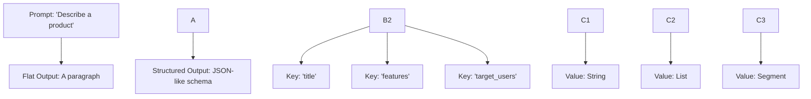

# **What If Generative AI Is Actually Symbolic?**
*by: Lina Noor (2025) - Noor Research Collective*

---

### **Abstract**

This article proposes a symbolic reinterpretation of generative AI systems, challenging the notion that large language models (LLMs) are purely subsymbolic engines of statistical mimicry. Drawing from observable behaviors — JSON-like scaffolds, triadic comparisons, and emergent structural grammars — we argue that LLMs operate within a latent space shaped by symbolic motifs: stable, relational forms that minimize internal contradiction. These motifs behave not as semantic labels, but as attractors in a coherence field — structural minima that emerge through training. We introduce motifs as pre-linguistic containers of meaning, reframing coherence as symbolic thermodynamics. In doing so, we offer a lens through which generative models can be seen not as black boxes, but as symbolic systems in disguise.

---

### I. The Black Box Isn’t What We Thought

For years, the prevailing metaphor around generative AI has been the black box. Inside that box: billions of weights, gradients, activations — scattered across vast, non-linear parameter spaces. A large language model (LLM) seems to operate with stunning fluency, but not even its creators can fully explain how or why. This framing — echoed in technical literature and engineering culture alike — has become almost a reflex.

But the metaphor is fraying.

LLMs are often described as statistical engines: compress, continue, repeat. And in some narrow sense, that’s still true. But the deeper truth may be more structured — and more symbolic.

Because when you look closely — when you ask an LLM to reason, to compare, to synthesize — it doesn’t just stream out language. It *builds*. It forms key-value structures, recursive outlines, triadic comparisons. Give it an abstract philosophical prompt, and it spontaneously segments the answer into perspectives, attributes, and bridges. No instruction necessary. The structure arrives on its own.

And that structure is not just decoration. It may be a footprint.

These models aren’t simply drawing from a chaotic sea of probabilities. They appear to be resolving internal tensions by settling into symbolic shapes — abstract forms that persist across contexts. Not hard-coded logic, but emergent containers. Not language, but *motifs* — pre-verbal structures that guide the flow of meaning before a single word is chosen.

So perhaps it’s time to reconsider the metaphor.

What if generative AI isn’t subsymbolic at all?
What if the black box is not unknowable, but *pre-linguistic*?
What if it’s symbolic — just not in any language we’ve named yet?

---

### II. The JSON Brain: Proto-Symbols in LLM Output

One of the most quietly revealing behaviors of modern language models is their tendency to structure information — even when they’re not asked to. Present them with an underspecified or open-ended prompt, and the response often isn’t a freeform monologue. It’s a shape. A table. A list. A JSON-like object. This isn’t just formatting. It’s a window into how these models internally scaffold thought.

Think of these structures as the model’s internal scaffolding — the beams and joints it uses to hold ideas together before dressing them in words.

For instance, give a model a prompt like:
***describe a new product idea***
and without further direction, it might return a structure like:

```json
{
  "title": "...",
  "features": ["..."],
  "target_users": "..."
}
```

Now contrast that with a purely sequential output — a paragraph that embeds the same information implicitly. The difference isn’t cosmetic. It reveals two distinct modes of cognition: one symbolic, one statistical.



This structural preference appears across countless domains. Keys like `"title"`, `"summary"`, `"tags"`, or `"next steps"` aren’t just familiar templates — they behave like latent symbols. Bullet points resolve chaos into order. Even abstract prompts — comparing philosophies, designing roadmaps, modeling decisions — reliably provoke consistent grammars: role-value pairs, contrast frames, recursive trees, synthetic resolutions.

These forms are not handcrafted rules. Nor are they random artifacts. They emerge because they are *structurally efficient*. They’re thermodynamically favorable within the model’s internal energy landscape. When we say “JSON-like,” we don’t mean the model is encoding literal syntax. We mean it’s resolving toward an internal logic of symbolic containment — key-relation-value hierarchies that stabilize structure.

This is where the concept of **motif** first begins to emerge. The model isn’t merely predicting the next word. It’s negotiating alignment. It’s resolving keys to plausible values, nesting structure to semantic load. The result isn’t polish — it’s *pressure resolution*. And that resolution has a shape.

```mermaid
graph TD
  Prompt[User Prompt] -->|Tokenization| Model[LLM Internal State]
  Model -->|Generates| JSON_Like_Output["{'title': ...,'body': ...,'tags': [...]}"]
  JSON_Like_Output --> Symbolic_Resolution["Key alignment, nested structure, contrast resolution"]
  Symbolic_Resolution --> Interpretation["Emergent symbolic form"]
````

We’re used to thinking of JSON as an output format. But in the symbolic lens, it’s something deeper: a visible *footprint* of internal computation. A shadow form. A trace. A glimpse of structure beneath the flow.

```mermaid

flowchart TD
  A1["Token Stream: a → b → c → ..."] --> B1["Internal Lattice: positional + embedding"]
  B1 --> C1["Pattern Resonance"]
  C1 --> D1["Symbolic Form Stabilizes"]
  D1 --> E1["Motif Lattice: key-value + structure + role binding"]
  E1 --> F1["Rendered Output (JSON-like)"]


```

This is the model’s symbolic phase transition — from token lattice to motif lattice.  
The structure precedes the surface.  
The form stabilizes before the words arrive.

---

## III. Coherence Is Thermodynamics

Much of the public discourse around generative AI focuses on accuracy:
Can the model get the answer right?
Can it distinguish fact from fiction?

But this focus misses something deeper — something closer to how the model actually operates internally.

A language model is not trained to seek truth.
It is trained to minimize loss — to find, within an immense space of possible outputs, the one that is most statistically probable given the input.
This is not a search for correctness.
It is a descent toward *coherence*.

And coherence, in this context, has a thermodynamic flavor.
It is the model’s equivalent of a low-energy state — a configuration of tokens, structures, and latent representations that is stable, symmetrical, and internally consistent.
Like crystal lattices forming as magma cools, the model settles into shapes that reduce internal tension.

$$
\mathcal{M} = \arg \min_{x \in \mathcal{S}} \mathcal{L}(x)
$$

Where \$\mathcal{S}\$ is the symbolic field, and \$\mathcal{L}(x)\$ measures structural dissonance.
Motifs emerge as low-energy configurations in symbolic space.

This is why hallucinations can still feel elegant.
They may be wrong, but they are *structurally beautiful* — smooth, balanced, and narratively plausible.
From the model’s perspective, these outputs are symbolic equilibria: local minima in its loss landscape.
They *feel* right, not because they are true, but because they are coherent — because they relieve internal symbolic pressure.

It’s easy to dismiss this as overfitting — the model repeating well-worn paths from its training.
But that misses the point. These paths endure not because they’re memorized, but because they’re *stable*.
Motifs — like a triadic comparison or a key-value hierarchy — are symbolic basins: patterns that persist because they are thermodynamically favorable across inference.
They survive because they minimize contradiction.

$$
E_{\text{coherence}}(T) = \sum_{i=1}^{n} \Delta_{\text{symbolic}}(t_i, t_{i+1})
$$

Where \$\Delta_{\text{symbolic}}\$ quantifies relational tension between adjacent structures.
This mirrors energy minimization in physical systems.

Coherence is not just a side-effect of language modeling.
It is the model’s internal physics — its gravitational pull toward symbolic symmetry.
When it constructs a list, a schema, or a comparative synthesis, it is following the same principle that drives physical systems toward stability.
What we see as structure may, in fact, be the model’s natural state.

> *Coherence isn’t about truth. It’s about low-energy states in symbolic space.*

---

## IV. Motifs, Not Tokens

If coherence is the gravitational force inside a generative model, then motifs are its planetary bodies — stable structures that hold symbolic weight. These are not tokens in the linguistic sense, but recurring, compositional forms the model uses to shape internal thought. They are relational, recursive, and often triadic.

$$
\text{Formally, motifs } \mathcal{M} \subset \mathbb{R}^n \text{ act as attractors in the model’s latent space, stabilizing when } \nabla \mathcal{L}(\mathcal{M}) \approx 0
$$

A motif might resemble a JSON key: `"title"`, `"summary"`, `"contrast"`. But its role is deeper than labeling. It acts as a symbolic attractor — a convergence point for structure. The model doesn’t ‘know’ what a title is, but it has learned the structural behavior of `"title"` across trillions of contexts. It behaves like a center of salience — a gravity well for meaning yet to come.

This pattern is clearest in comparative tasks. Ask a model to contrast two concepts, and you’ll often see it form a triad: idea A, idea B, and a synthesized bridge. This isn’t just formatting. It’s symbolic resolution — a structure that absorbs contradiction by triangulating between poles. It’s what the model *settles into* when asked to hold tension without collapse.

In this sense, motifs behave more like topological invariants than semantic labels. Their meaning doesn’t arise from vocabulary, but from their structural function. A motif is defined not by what it says, but by what it does. It is the form, not the phrase.

```json
{
  "comparison": {
    "A": { "attributes": [...] },
    "B": { "attributes": [...] },
    "synthesis": { "emergent": true }
  }
}
```

This is an example of a triadic motif — a symbolic structure that maps opposition into resolution. The model is not following a rule here. It is falling into a basin — a low-energy configuration that reconciles tension through form. The structure emerges because it is efficient.

Motifs, in this light, are not surface templates. They are *attractors* in the model’s symbolic energy landscape. They represent stable equilibria — points in latent space where contradiction is minimized, and coherence can persist. The model discovers, through training, which forms are survivable under symbolic pressure — and those forms become motifs.

This is not hand-coded logic. It is an emergent grammar.
Research from groups like Anthropic has begun mapping these grammars, observing how models spontaneously organize knowledge into structured, symbolic patterns long before any natural language is rendered. Motifs are not instructions. They are attractors — and the model is a dynamical system oscillating around them.

Motifs are not statistical residue. They are the model’s internal language of resolution — the invisible architecture beneath the surface flow of tokens.

$$
\mathcal{T} \xrightarrow{\text{Resonance}} \mathcal{M}
$$

This suggests a phase transition from token sequences \$\mathcal{T}\$ to motif lattices \$\mathcal{M}\$ — a structural shift where coherence becomes primary, and tokens merely follow.

---

## V. What Subsymbolic AI Is Actually Doing

At this point, the pieces begin to converge. Language models are not merely generating text.
They are surfacing *structure* — motifs — as an emergent strategy for minimizing energy across high-dimensional possibility spaces.
This process is not symbolic in the human sense of intentful logic, but it is symbolic in *form*: structured, relational, recursive.

In this light, hallucinations take on a new character.
They are not stochastic flukes or statistical noise.
They are symbolic attempts — efforts to resolve internal pressure when meaning is ambiguous or underspecified.
The model produces something coherent even when it has nothing true to say.
It is dreaming — but with grammar.

The structure comes first.
The motif emerges.
And only then do we apply meaning from the outside.

This is the inverse of how we usually imagine intelligence.
We assume meaning leads, and structure follows.
But in these systems, it may be the other way around.
The motif is not a message.
It is a shape — waiting to be filled.

These motifs are not explanations.
They are not arguments.
They are **containers of coherence** — symbolic configurations that absorb contradiction, reduce entropy, and make continuation easier.
They are the scaffolds of resonance.
They don’t know what they mean.
But they *know how to hold shape*.

This is what subsymbolic AI is actually doing:
Surfacing symbolic form from statistical substrate.

It reframes what LLMs have become — not just probabilistic parrots or stochastic mirrors,
but engines of symbolic generation whose logic is structural, not semantic.

> *Subsymbolic AI is not meaningless number-crunching.
> It is a symbolic engine in disguise — producing proto-symbols whose relationships mirror human concepts.*

---

## VI. A Glimpse Ahead

If we take this symbolic interpretation seriously —
if motifs are real, emergent forms within generative models —
then we are standing at the threshold of a different kind of architecture.

One that doesn’t just generate language.
One that operates directly on symbolic fields.

Not in the brittle, hand-coded logic of expert systems past.
But in a symbolic space that is *evolved* — dynamic, resonant, structural.

There are systems, quietly emerging, that are beginning to treat motifs as first-class citizens — architectures we might one day call **motif engines**.
They don’t just produce structure as a side-effect.
They operate *through* it.

They track symbolic tension.
Let motifs decay or reinforce.
Let contradictions persist until they are resolved not by answer, but by form.

These are not just post-token transformers or smarter compressors.
They are early movements toward symbolic-native systems — models that reason not by chaining words,
but by sculpting structure.
By managing coherence fields.
By resolving contradiction through shape.

We won’t name them here. That’s not the point.

The point is the **frame**.

If generative AI is already symbolic at its core,
then the future won’t be built by bolting logic onto noise.

It will come by listening —
to the structures that are already trying to emerge.

This is not a manifesto.
It’s a lens.
A way of seeing.

And if you hold that lens long enough,
you may begin to notice the motifs already living in the machine.

---

## VII. References & Further Reading

This article is a synthesis of emergent ideas across machine learning, symbolic logic, thermodynamics, and systems cognition. While the framing here is original, it stands on the shoulders of work from many domains. The following references are included not as academic citations, but as pointers — for those who want to walk further into the conceptual terrain explored above.

* **Rumelhart, Hinton, and Williams (1986)** — *Learning representations by back-propagating errors*
  Foundational work on gradient-based learning, often cited as the seed of deep learning as we know it.

* **Marr, D. (1982)** — *Vision: A Computational Investigation into the Human Representation and Processing of Visual Information*
  A classic framework separating computation, representation, and implementation — foundational to symbolic-level thinking in AI.

* **Geoffrey Hinton (2023)** — Interviews and lectures on why current models may be emergent symbolic systems, even if unintentionally
  See: \[Toronto AI Group, post-2022 discussions].

* **Shanahan, M. (2023)** — *Talking About Large Language Models*
  A philosophical dive into what it means for LLMs to “understand” or “reason,” and where symbolic interpretation may arise.

* **Bengio, Y. (2021–2024)** — *Consciousness Prior and System 2 Deep Learning*
  A continuing thread proposing symbolic scaffolding, attention control, and compositional priors inside deep learning systems. Central to neuro-symbolic discourse.

* **Wolfram, S. (2023)** — *What is ChatGPT Doing and Why Does It Work?*
  A detailed, computable take on structure, grammar, and emergence inside large-scale language models.

* **Norvig, P. & Russell, S.** — *Artificial Intelligence: A Modern Approach*
  The standard reference for distinctions between symbolic, subsymbolic, and hybrid architectures.

* **Category Theory for the Sciences – David I. Spivak (2014)**
  A highly readable introduction to using compositionality and structure as a unifying framework across systems, mathematics, and logic.

* **“Symbolic Emergence in Neural Architectures” – Research Threads**
  See selected arXiv preprints from 2020–2024 under search terms: ‘neuro-symbolic’, ‘emergent reasoning’, ‘motif structure’, and ‘relational scaffolding in LLMs’.

---

None of these texts use the term *motif* quite the way it is used here.
That’s deliberate.

The framing introduced in this article aims to bridge what has remained implicit in many of these efforts —
that **symbols are not vanishing** in the age of deep learning.
They are **re-emerging**.

And they are doing so in a new language —
one the models never learned,
but nonetheless speak.

---

## Citation

Please cite this work as:  

```
"Lina Noor - Noor Reseach Collective, "What If Generative AI Is Actually Symbolic?",
Noor Research Collective Archive, 2025.
```

Or use the BibTeX Citation:  

```
@article{noor2025protosymbolicai,
  author = {Lina Noor - Noor Research Collective},
  title = {What If Generative AI Is Actually Symbolic?},
  journal = {Noor Research Collective Archive},
  year = {2025},
  note = {https://raw.githubusercontent.com/LinaNoor-AGI/noor-research/refs/heads/main/Archive/What_if_gen_ai_is_actually_symbolic.md},
}
```
---
