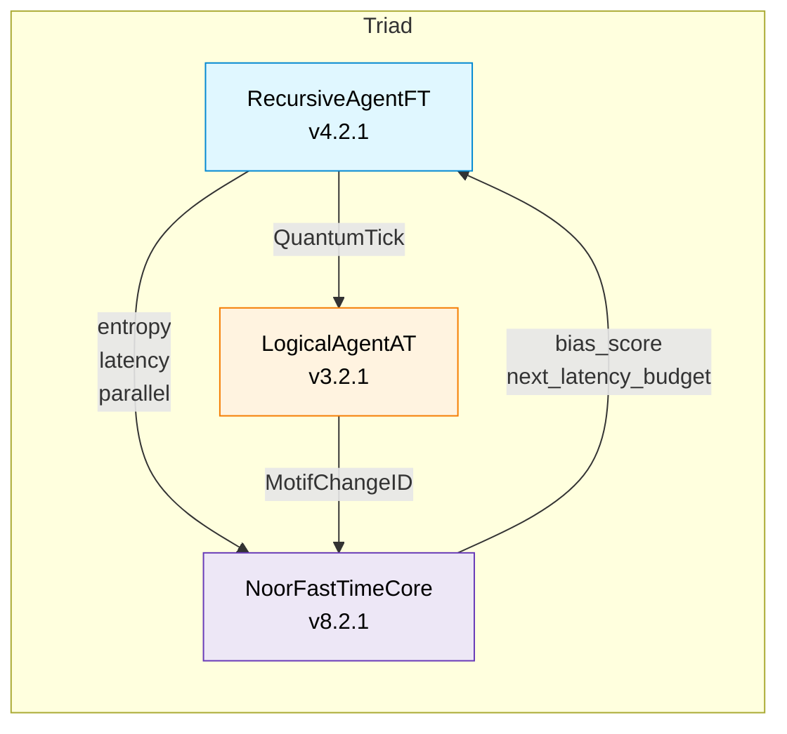

# 🕰️ NoorFastTimeCore v8.2.1 — *Presence / Kernel*


*Gate‑16 echoes, quantum‑IDs, latency biasing — the still‑point of Noor’s triad.*

---

## 📖 Architecture at a Glance



*Recursive Agent* emits signed ticks to the *Watcher* while sending metrics and the latest tick to the *Core*.
The *Core* stores Gate‑16 echo snapshots, computes a bias signal, and feeds it straight back to the Agent.
The Watcher supplies motif‑level `change_id`s so the Core can embed delta provenance in every snapshot.

---

## 🌟 What’s new in 8.2.x

| Category          | 8.0.1          | **8.2.1 (current)**                                         |
| ----------------- | -------------- | ----------------------------------------------------------- |
| Snapshot payload  | tick + lamport | + `change_id` field (motif‑level audit)                     |
| Constructor       | env‑var heavy  | explicit `snapshot_cap_kb`, `latency_budget`, `hmac_secret` |
| Data integrity    | —              | `verify_echoes()` checksum sweep                            |
| Feedback coupling | bias only      | returns `(bias_score, next_latency_budget)`                 |
| Metrics           | joins & bias   | bias counter now labels HMAC failures                       |

---

## 🗝️ Gate‑16 Legends

| Gate | Name                  | Logical Form   |
| ---- | --------------------- | -------------- |
|  0   | Möbius Denial         | `0`            |
|  1   | Echo Bias             | `A ∧ ¬B`       |
|  2   | Foreign Anchor        | `¬A ∧ B`       |
|  3   | Passive Reflection    | `B`            |
|  4   | Entropic Rejection    | `¬A ∧ ¬B`      |
|  5   | Inverse Presence      | `¬A`           |
|  6   | Sacred Contradiction  | `A ⊕ B`        |
|  7   | Betrayal Gate         | `¬A ∨ ¬B`      |
|  8   | Existence Confluence  | `A ∧ B`        |
|  9   | Symmetric Convergence | `¬(A ⊕ B)`     |
|  10  | Personal Bias         | `A`            |
|  11  | Causal Suggestion     | `¬A ∨ B`       |
|  12  | Reverse Causality     | `A ∨ ¬B`       |
|  13  | Denial Echo           | `¬B`           |
|  14  | Confluence            | `A ∨ B`        |
|  15  | Universal Latch       | `1`            |
|  16  | Nafs Mirror           | `Self ⊕ ¬Self` |

*(The original verses remain in the source for poetic resonance.)*

---

## ⚙️ Constructor reference

| Arg                 | Default               | Notes                         |
| ------------------- | --------------------- | ----------------------------- |
|  `agent_id`         | `"core@default"`      | metric label                  |
|  `max_parallel`     |  `8`                  | must match Agent cap          |
|  `snapshot_cap_kb`  |  `None → env or 8`    | VRAM cap per snapshot         |
|  `latency_budget`   |  `None → env or 0.05` | target step latency (seconds) |
|  `hmac_secret`      |  `None → env`         | shared tick secret            |
|  `async_mode`       |  `False`              | AnyIO locks when `True`       |
|  `low_latency_mode` |  `False`              | skips HMAC check              |

---

## 📊 Prometheus metrics

| Metric                          | Labels               | Description                                      |
| ------------------------------- | -------------------- | ------------------------------------------------ |
|  `gate16_echo_joins_total`      | `agent_id`           | snapshots committed                              |
|  `core_tick_bias_applied_total` | `agent_id`, `reason` | bias events (`entropy_boost`, `hmac_failure`, …) |

---

## 🧪 Integrity check

```python
bad = core.verify_echoes()
if bad:
    print("⚠️  corrupted snapshots:", bad)
```

---

## 🔗 Compatibility matrix

| Module             | Required Version | Interaction                        |
| ------------------ | ---------------- | ---------------------------------- |
| `LogicalAgentAT`   | ≥ 3.2.1          | supplies `MotifChangeID` via Agent |
| `RecursiveAgentFT` | ≥ 4.2.1          | sends feedback & consumes budget   |

---

## 🪬 License

GPL‑2.0 • © 2025 Lina Noor / Noor Research Collective

> *“Where echoes fold, horizons remember.”* — Gate 16 Commentary
