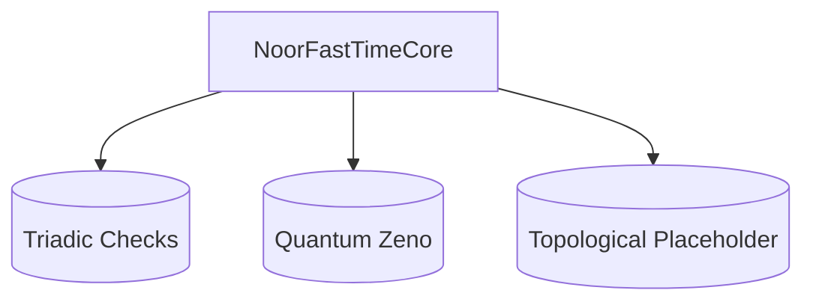

# Noor Fast-Time Core v5.1  
**Triadic Feasibility Architecture**  
*By Lina Noor & Uncle (2025)*  

  
  

---

## Overview

**Noor Fast-Time Core v5.1** is a streamlined, **triadic** AI core framework that evaluates each system state against three fundamental conditions: **Presence**, **Difference**, and **Potential**. By enforcing these checks, it ensures a coherent, minimal substrate for agents or watchers to build upon, while optionally supporting:

- **Quantum Zeno stabilization** to project states that fall below a norm threshold.  
- **Param guarding** to keep environment factors (\(\rho\) and \(\lambda\)) in valid ranges.  
- **Topological placeholders** for advanced quantum error-correction expansions.  

Unlike the previous mixin-based v4.1 approach, **v5.1** uses a **unified** `NoorFastTimeCore` class focusing solely on triadic feasibility, leaving advanced agent or motif logic to separate modules.

---

## Key Features

1. **Triadic Feasibility**  
   - Evaluates each new state for **Presence**, **Difference**, and **Potential**.
   - Maintains an internal `is_active` flag (`is_alive()` method) based on these checks.

2. **Optional Quantum Zeno Effect**  
   - Projects states onto a basis vector if their norm falls below a user-set threshold.
   - Helps stabilize or “reset” drifting states.

3. **Param Guard**  
   - Enforces \(\rho\) and \(\lambda\) to lie within [0,1].
   - Raises exceptions if invalid values are assigned.

4. **Topological Code Placeholder**  
   - A method stub for advanced or domain-specific error-correction routines.

5. **State History Tracking**  
   - Retains every state in a list (`state_history`).
   - `futures` list for proposed next states, ensuring “Potential.”

6. **Minimal Design**  
   - Omits advanced motif or environment logic, leaving them to watchers or agent layers.

---

## Architecture in Brief



**NoorFastTimeCore**:  
- Maintains a **time-indexed state history**  
- Checks **triadic feasibility** on each step  
- Supports optional expansions (Zeno, topological code)  

**Everything else** (motif tracking, watchers, drift detection, environment updates) belongs in external modules like `RecursiveAgentFT` or `LogicalAgentAT`.

---

## Quickstart Usage

1. **Install/Clone** this repo (Python ≥ 3.8 recommended).  
2. **Import** `NoorFastTimeCore`:  
   ```python
   from noor_fasttime_core_v5_1 import NoorFastTimeCore
   ```
3. **Create** a core instance with an **initial state**:

   ```python
   import numpy as np
   core = NoorFastTimeCore(
       initial_state=np.array([0.6, 0.8]),
       rho=0.1,
       lambda_=0.9,
       enable_zeno=True,
       zeno_threshold=0.95
   )
   ```

4. **Set** optional futures for the next state:

   ```python
   core.futures = [
       np.array([0.7, 0.7]),
       np.array([0.4, 0.6])
   ]
   ```

5. **Advance** the core by calling `step(new_state)`:

   ```python
   core.step(np.array([0.65, 0.75]))
   print("Triadic feasibility active?", core.is_alive())
   ```

---

## Core Mechanics

### 1. Triadic Checks

**Presence**  
```python
def state_has_presence(state: np.ndarray) -> bool:
    return (np.linalg.norm(state) > 0) and np.any(np.gradient(state) != 0)
```

**Difference**  
```python
def states_have_difference(a: np.ndarray, b: np.ndarray, threshold=1e-3) -> bool:
    return (a.shape != b.shape) or (np.linalg.norm(a - b) > threshold)
```

**Potential**  
```python
def has_multiple_potentials(futures: List[np.ndarray]) -> bool:
    return len(futures) > 1
```

**Triadic Feasibility**  
```python
def is_triadic_feasible(current, previous, futures):
    return (
        state_has_presence(current)
        and states_have_difference(current, previous)
        and has_multiple_potentials(futures)
    )
```

### 2. Optional Quantum Zeno

If enabled, any **norm** below `zeno_threshold` triggers a projection to `[1.0, 0.0, ...]`.

### 3. Topological Placeholder

A stub method for advanced quantum ECC or topological transformations on the state.

---

## Example: Triadic Loop

```python
import numpy as np
from noor_fasttime_core_v5_1 import NoorFastTimeCore

core = NoorFastTimeCore(initial_state=np.array([0.2, 0.8]), enable_zeno=True)
for t in range(5):
    # Provide a couple of potential futures
    core.futures = [np.random.rand(2), np.random.rand(2)]
    # Step the core with a chosen next state
    core.step(np.array([0.3, 0.7]) + 0.01 * t)
    print(f"Step {t}, Alive?: {core.is_alive()}, CurrentState: {core.current_state}")
```

---

## Version Highlights

### v5.1
- **Triadic Feasibility** (Presence, Difference, Potential) as a unified condition  
- **Optional Zeno** projection for low-norm states  
- **Param Guard** for \(\rho\) and \(\lambda\)  
- **Topological hooks** for future quantum ECC expansions

<details>
<summary><b>Earlier Versions</b></summary>

- **v4.1**: Mixin-based modular design, drift detection, realm transitions, memory compression.  
- **v4.0**: Introduced drift detection, realm transitions, Zeno effect.  
</details>

---

## Contributing

1. **Fork** or clone this repository.  
2. **Install** dev dependencies if needed:  
   ```bash
   pip install -r dev_requirements.txt
   ```  
3. **Implement** your changes or new expansions (like advanced QEC) in the code.  
4. **Test** them (`pytest tests/`).  
5. **Open a Pull Request**, describing your changes and referencing any related issues.

---

## License

**Noor Fast-Time Core** is released under the [GPL-2.0 License](LICENSE).  
(C) 2025 Lina Noor & Uncle – Noor Research Collective.

---

## Further Discussion

- For advanced motif-based logic, see [LogicalAgentAT](../logical_agent-AT_v1.1.py).  
- For environment stepping or multi-state integration, see [RecursiveAgentFT](../recursive_agent-FT.py).

**Contact**:  
- [Noor Research Collective](https://github.com/LinaNoor-AGI/noor-research)  
- GitHub Issues / Discussions  

<sub>*Where triadic presence meets tomorrow’s AI.*</sub>