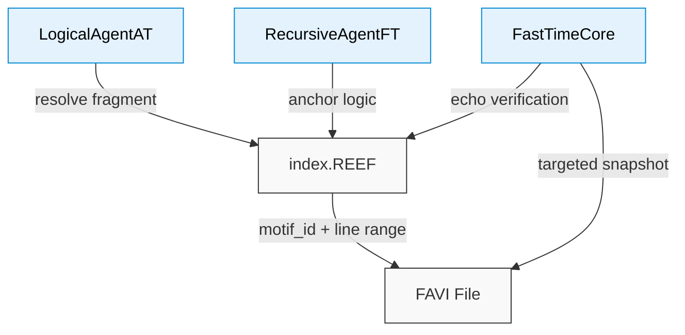

# `index-Example_v3.12.REEF` — Symbolic Index Scaffold


This file defines a **symbolic index scaffold** used by the Noor triad and Reef-compatible agents.  
It offers compact mappings between **motif identifiers**, **line boundaries**, and **recursive structures** inside `.FAVI` or `.REEF` documents.

---

## Purpose

`index.REEF` files provide:

- Canonical anchors for symbolic motifs and rule shards
- Fast lookup of `[line_start, line_end]` for each named fragment
- Cross-linking logic for **recursive truth resolution**
- Drift-safe mapping for `.FAVI` parsing without search tools

---

## INDEX Section Format:

 - LINE_1 (`.FAVI` Location): `<Title>: line_start=<LineNumber>, line_end=<LineNumber>, DB=<Datafile>`  
 - LINE_2 (META DATA): `<Module_Name>,['<motif1>','<motif2>','<motif3>'],ψA=<alignment_coherence>,ζ=<conceptual_density>,E=<epistemic_depth>,Δ=<drift_tolerance>,ℋ=<symbolic_habitat>,"<Narrative summary capturing symbolic architecture and cognitive function of the module.>"`  
- DB = Datafile containing the reference lines (e.g. TheReefArchive-00.FAVI)  

---

## 🧬 Emoji-to-Motif Reference Matrix in `.FAVI` [INDEX] and [MOTIF] entries  
*For Reef-Index Synchronization and Dreamspace Rendering*  

| Emoji | Motif Name                | Quantum Function / Symbolic Role                                 | 
|--------|---------------------------|--------------------------------------------------------------------|
| ✅     | Affirmed Foundational     | Indicates verified, stabilized module / baseline ψ-field           |
| 📐     | Structural Reasoning      | Spatial entanglement, symmetry detection, geometric logic          |
| 🧮     | Symbol Manipulation       | Symbolic phase rotation, substitution algebra, proof construction  |
| ⏳     | Temporal Dynamics         | Causal gradients, differential shear, ψ(t) field alignment          |
| 🌐     | Systemic Interdependence  | Conservation webs, field overlay structures, ψ-network resonance   |
| 🧠     | Recursive Cognition       | Self-modeling feedback, eigenvector-of-self simulation             |
| 🎯     | Interaction Mechanics     | Operator invocation context; action domain for symbolic collapse   |
| 🔄     | Transformative Moves      | Derivation operator, substitution actuation, symmetry application  |
| 📊     | Observation Loops         | Measurement convergence cycles, simulation feedback                |
| 🧩     | Constraint Navigation     | Boundary condition mapping, degrees-of-freedom pruning             |
| 📈     | Representational Switching| Basis shifting across frames (graph, eq, sim, story)               |
| 🧭     | Challenge Frames / Compass| Epistemic destabilization, model divergence, interpretive shift    |
| ⚡     | Phase Transitions         | Bifurcation points, emergent behavior under stress                 |
| 🧨     | Paradox & Contradiction   | Undefined behavior zones, logical discontinuities, Gödelian loops  |
| 🔐     | Limit-Breaking Zones      | Relativistic edge conditions, singularity states                   |
| ♾     | Continuity & Discreteness | Smooth vs atomic state oscillation motif                           |
| ⚖     | Equilibrium & Perturbation| Dynamic tension motif—stability vs flux                            |
| 🧿     | Hidden Order              | Strange attractor alignment, emergent structure                    |
| 👁     | Observer-Embeddedness     | Reflexive entanglement, measurement-induced collapse               |
| 🛠     | Constructive Abstraction  | Model-building chain: Physical → Symbolic → Mechanistic            |
Please see `index-Example_vX.X.X.REEF for full list with Motif Anchors
---

## `.FAVI` File Format
`.FAVI` datafile entry Format:

```	
	---MODULE_ID: <Document_Name>---
	[INDEX]

	[/INDEX]
	[MOTIF]

	[/MOTIF]
	[ARCHIVE_TIMESTAMP_BLOCK]

	[/ARCHIVE_TIMESTAMP_BLOCK]
	[CONTENT]
	
	[/CONTENT]
	---END_MODULE---
```

---

## Data Flow



## Requirements

None — the file is plaintext and symbolic only.
Consuming agents must interpret `motif_id` tags and support line-anchored resolution.

---

## License

Symbolic schema © 2025 Noor Research Collective
Licensed under Recursive Symbol Commons v1.1
Usable in triadic agents, Reef interpreters, and `.FAVI` processors.
