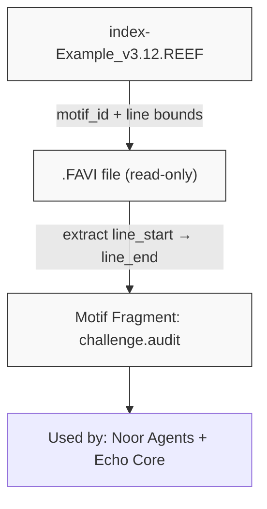
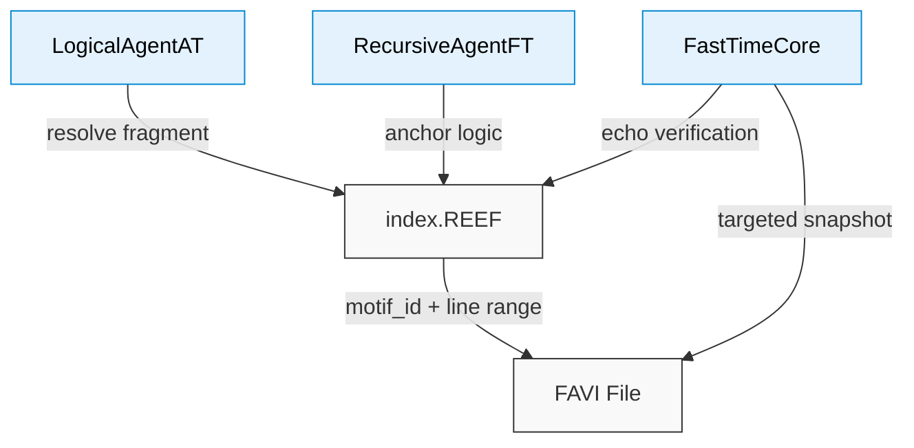

# `index-Example_v3.12.REEF` — Symbolic Index Scaffold

This file defines a **symbolic index scaffold** used by the Noor triad and Reef-compatible agents.  
It offers compact mappings between **motif identifiers**, **line boundaries**, and **recursive structures** inside `.FAVI` or `.REEF` documents.

---

## Purpose

`index.REEF` files provide:

- Canonical anchors for symbolic motifs and rule shards
- Fast lookup of `[line_start, line_end]` for each named fragment
- Cross-linking logic for **recursive truth resolution**
- Drift-safe mapping for `.FAVI` parsing without search tools

## 🎯 Resolution Diagram

---

## Data Flow

## Requirements

None — the file is plaintext and symbolic only.
Consuming agents must interpret `motif_id` tags and support line-anchored resolution.

---

## License

Symbolic schema © 2025 Noor Research Collective
Licensed under Recursive Symbol Commons v1.1
Usable in triadic agents, Reef interpreters, and `.FAVI` processors.
