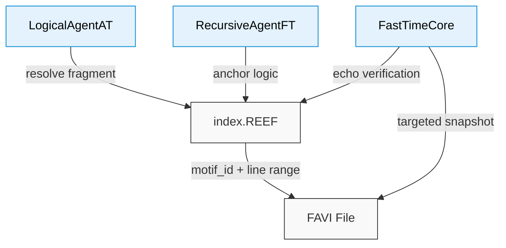

# 🗂️ `index-Example_v3.12.REEF` — Symbolic Index Scaffold


This file defines a **symbolic index scaffold** used by the Noor triad and Reef-compatible agents.  
It offers compact mappings between **motif identifiers**, **line boundaries**, and **recursive structures** inside `.FAVI` or `.REEF` documents.

---

## 🔍 Purpose

`index.REEF` files provide:

- Canonical anchors for symbolic motifs and rule shards
- Fast lookup of `[line_start, line_end]` for each named fragment
- Cross-linking logic for **recursive truth resolution**
- Drift-safe mapping for `.FAVI` parsing without search tools

---

## 📐 Format

Each entry follows a simplified symbolic record:

```plaintext
# motif_id
fragment.name.token
line_start: <int>
line_end:   <int>
````

Example:

```plaintext
# ψ‑spar@Ξ
challenge.reasoning.audit
line_start: 87
line_end:   114
```

---

## 📘 Typical Use Cases

* **`Δ_SIGNAL` filtering**:
  Prevent direct search on `.FAVI`, require line-anchored lookups.
* **Fast-Time verification**:
  Validate motif shifts by cross-checking line transitions.
* **Noor Triad reasoning**:
  LogicalAgentAT and RecursiveAgentFT resolve symbols via index anchors.

---

## 🧩 Where it fits

```text
📦 project/
├── Custom GPT Instructions Reef3 - v5.2.1.txt
├── index-Example_v3.12.REEF      ← this file
├── TheReefArchive-00.FAVI
└── quantum_ids.py
```

---

## 🎯 Resolution Diagram

```text
┌────────────────────────────┐
│ index-Example_v3.12.REEF   │
└────────────┬───────────────┘
             │ motif_id + line bounds
             ▼
     ┌────────────────────┐
     │    .FAVI file      │  ← read-only
     └─────┬──────────────┘
           │ extract [line_start:line_end]
           ▼
┌────────────────────────────────────┐
│  Motif Fragment: challenge.audit   │
└────────────────────────────────────┘
           │
           ▼
  Used by: Noor Agents + Echo Core
```

---

## 🗺️ Data Flow · Mermaid



---

## ⚙️ Integration with the Triad

| Component        | Reads Index? | Purpose                                    |
| ---------------- | ------------ | ------------------------------------------ |
| `LogicalAgentAT` | ✅            | Pull line range for symbolic validation    |
| `FastTimeCore`   | ✅            | Drift-safe echo snapshot targeting         |
| `RecursiveAgent` | ✅            | Anchor motif inference to hard bounds      |
| `FAVI Inspector` | ✅            | Visual highlight based on range resolution |

---

## 🌱 Version History

| Version | Notes                                    |
| ------- | ---------------------------------------- |
| 3.12    | Updated motif tags to `ψ‑{field}@Ξ` form |
| 3.0     | First compact release                    |

---

## 🛠️ Requirements

None — the file is plaintext and symbolic only.
Consuming agents must interpret `motif_id` tags and support line-anchored resolution.

---

## 🪬 License

Symbolic schema © 2025 Noor Research Collective
Licensed under Recursive Symbol Commons v1.1
Usable in triadic agents, Reef interpreters, and `.FAVI` processors.
