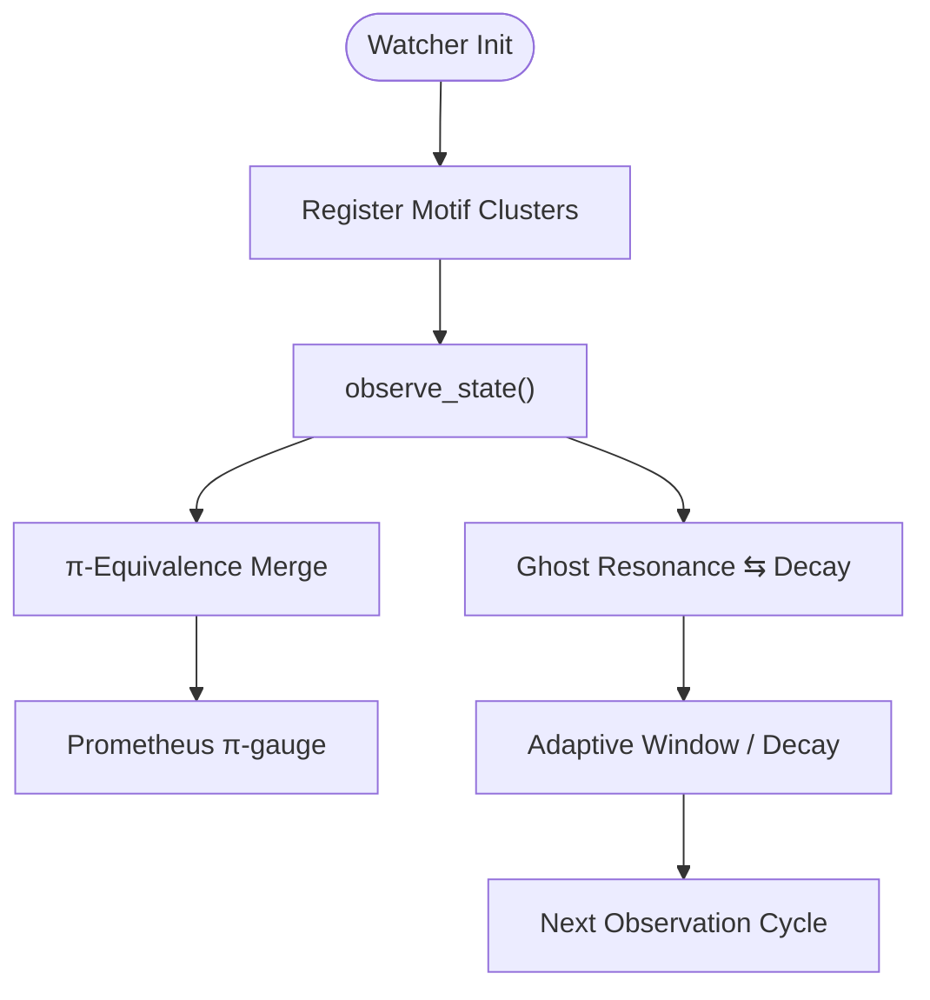

# 👁️ LogicalAgentAT v2.8.1


*Symbolic watcher with topology, cluster‑algebra, **π‑groupoid** equivalence and ghost ecology.*

---

## 📖 Overview

`LogicalAgentAT v2.8.1` is the watcher pillar of the Noor triadic AI framework.  
It observes symbolic states, nurtures motif clusters, manages ghost lifecycles **and now tracks path‑identity (homotopy) classes** through an optional π‑groupoid mode.  
Key pillars:

| Pillar | Purpose |
| ------ | ------- |
| **Ecology** | Registers and decays dyads/triads, self‑tuning context window |
| **Ghosts** | Resonant ghosts ascend to active fields; silent motifs drift away |
| **Topology** | *New* knot ID tags & ring‑patch overlap checks |
| **π‑Groupoid** | *New* equivalence registry for homotopic symbolic paths |
| **Observability** | Prometheus metrics for latency, dyad ratio, π‑classes |

---

## 🚀 Installation

```bash
pip install numpy networkx prometheus_client
```

---

## 🌟 What’s New in **v2.8.1**

| Feature | Description |
|---------|-------------|
| **π‑Groupoid Mode** | Track homotopy/identity tags via `register_path_equivalence()` and query with `are_paths_equivalent()` |
| **Prometheus Gauges** | `logical_agent_pi_equivalences_total`, `logical_agent_pi_classes_gauge` |
| **Config Flags** | `enable_pi_groupoid` (off by default), `pi_max_classes` soft‑cap |
| **Union‑Find Backbone** | Efficient path‑compression merge of equivalence classes |
| **Updated Serialization** | π‑data persisted in `to_dict()` / `from_dict()` |
| **Doc & Mermaid refresh** | New diagrams and examples for π‑logic |

---

## 🌿 Ecology & π‑Groupoid Workflow



---

## 🧩 Quick‑Start Examples

### Basic Watcher

```python
from logical_agent_at import LogicalAgentAT
w = LogicalAgentAT(verbose=True)
w.register_motif_cluster(["alpha", "beta", "gamma"], strength=0.8)
```

### Enabling π‑Groupoid Mode

```python
w = LogicalAgentAT(enable_pi_groupoid=True, pi_max_classes=5000)

# Declare two symbolic paths equivalent
w.register_path_equivalence("π:abcd1234", "π:deadbeef")
assert w.are_paths_equivalent("π:deadbeef", "π:abcd1234")
```

---

## 📊 Prometheus Metrics

| Metric | Type | Meaning |
| ------ | ---- | ------- |
| `logical_agent_step_latency_seconds` | Histogram | `observe_state()` latency |
| `noor_dyad_ratio` | Gauge | Triad/Dyad context balance |
| `logical_agent_pi_equivalences_total` | Counter | Successful π‑merges |
| `logical_agent_pi_classes_gauge` | Gauge | Active π‑equivalence classes |

---

## ⚙️ Key API

| Method | Category | Purpose |
| ------ | -------- | ------- |
| `register_motif_cluster()` | Ecology | Add new motif clusters |
| `observe_state()` | Ecology | Feed symbolic vector state |
| `register_ghost_motif()` / `promote_ghost_to_field()` | Ghost | Ghost lifecycle mgmt |
| `register_path_equivalence()` | π‑Groupoid | Declare two π‑tags equivalent |
| `are_paths_equivalent()` | π‑Groupoid | Query equivalence |
| `export_pi_metrics()` | π‑Groupoid | Summary stats for Core feedback |

---

## 🔗 Compatibility

| Module | Min Version | Role |
| ------ | ----------- | ---- |
| **NoorFastTimeCore** | 7.4.2 | Presence Kernel |
| **RecursiveAgentFT** | 3.8.0 | Symbolic traversal & π‑tag emitter |

---

## 📜 License

Licensed under [GPL‑2.0](https://www.gnu.org/licenses/old-licenses/gpl-2.0.html).  
© 2025 Lina Noor & Noor Research Collective

---

## 🤝 Contributing

Issues, feature proposals & pull‑requests welcome! Help us evolve symbolic ecology. 🌱
