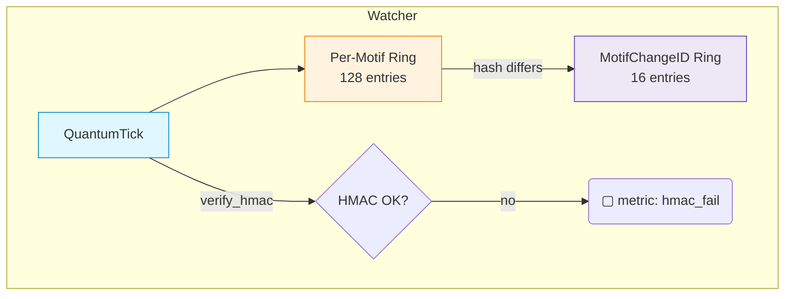

# 👁️ LogicalAgentAT v3.2.0


*Symbolic watcher with Quantum‑Tick 2.0, dynamic feature flags, π‑groupoid topology **and now motif‑change provenance**.*

---

## 📖 Overview

`LogicalAgentAT` is the Watcher pillar of the Noor triad.
It buffers signed **QuantumTicks**, detects **motif‑level changes**, manages dynamic run‑time flags, and maintains a fast **π‑groupoid union‑find** for symbolic‑path equivalence.

### Core Pillars

| Pillar                    | Purpose                                                                |
| ------------------------- | ---------------------------------------------------------------------- |
| **Quantum‑Tick 2.0**      | Lamport + HLC stamps, HMAC verification, per‑motif ring buffers        |
| **Motif‑Change Registry** | Emits `MotifChangeID` objects whenever a motif diverges, keeps last 16 |
| **Dynamic Feature Flags** | Thread‑safe toggle system; Prometheus‑tracked                          |
| **π‑Groupoid**            | Path‑identity merge / query with union‑find compression                |
| **Observability**         | Prom metrics for ticks, HMAC failures, flag flips                      |

---

## 🌟 What’s new in 3.2.0

| Feature                   | Description                                                                                 |
| ------------------------- | ------------------------------------------------------------------------------------------- |
| **MotifChangeID ring**    | `register_tick()` appends a change‑ID when `coherence_hash` differs from the previous tick. |
| **`get_latest_change()`** | Retrieve the most recent change‑ID for any motif.                                           |
| **Explicit ctor args**    | `hmac_secret`, `async_mode` now explicit — env‑vars only if arg is `None`.                  |
| **Mermaid refresh**       | Updated data‑flow diagram below.                                                            |

---

## 🗺️ Watcher Data‑Flow



---

## ⚙️ Constructor

```python
LogicalAgentAT(
    agent_id="watcher@default",
    enable_quantum_ticks=True,
    tick_buffer_size=128,
    pi_max_classes=20_000,
    hmac_secret=None,          # explicit > env‑var
    async_mode=False,
    verbose=False,
)
```

*If `async_mode=True` and **anyio** is installed, the Watcher switches to async‑safe locks.*

---

## 🧩 Key API

| Method                            | Category   | Purpose                            |
| --------------------------------- | ---------- | ---------------------------------- |
| `register_tick(motif, tick)`      | Core       | Buffer tick & maybe make change‑ID |
| `get_latest_tick(motif)`          | Core       | Most recent tick in buffer         |
| **`get_latest_change(motif)`**    | *new*      | Most recent `MotifChangeID`        |
| `set_feature(name, val)`          | Flags      | Flip a dynamic flag (Prom‑logged)  |
| `register_path_equivalence(a, b)` | π‑Groupoid | Merge two symbolic paths           |
| `are_paths_equivalent(a, b)`      | π‑Groupoid | Query equivalence                  |

---

## 🛠️ Quick‑Start

```python
from logical_agent_at import LogicalAgentAT, QuantumTick
from quantum_ids import make_change_id

w = LogicalAgentAT(verbose=True)

# emit a pair of ticks
t1 = QuantumTick.now("α", agent_id="agent@demo")
w.register_tick("α", t1)

t2 = QuantumTick.now("α", agent_id="agent@demo")
w.register_tick("α", t2)

print("Latest change:", w.get_latest_change("α"))
```

---

## 📊 Prometheus metrics

| Metric                                   | Labels              | Meaning            |
| ---------------------------------------- | ------------------- | ------------------ |
| `logical_agent_ticks_total`              | `stage`, `agent_id` | Ticks accepted     |
| `logical_agent_tick_hmac_failures_total` | `agent_id`          | Bad HMACs          |
| `logical_agent_feature_toggles_total`    | `flag`, `agent_id`  | Dynamic flag flips |

---

## 🔗 Compatibility

| Module               | Min Version | Interaction                       |
| -------------------- | ----------- | --------------------------------- |
| **NoorFastTimeCore** | ≥ 8.2.0     | Core reads latest `MotifChangeID` |
| **RecursiveAgentFT** | ≥ 4.2.0     | Emits ticks consumed by Watcher   |

---

## 📄 License

GPL‑2.0 • © 2025 Lina Noor / Noor Research Collective
