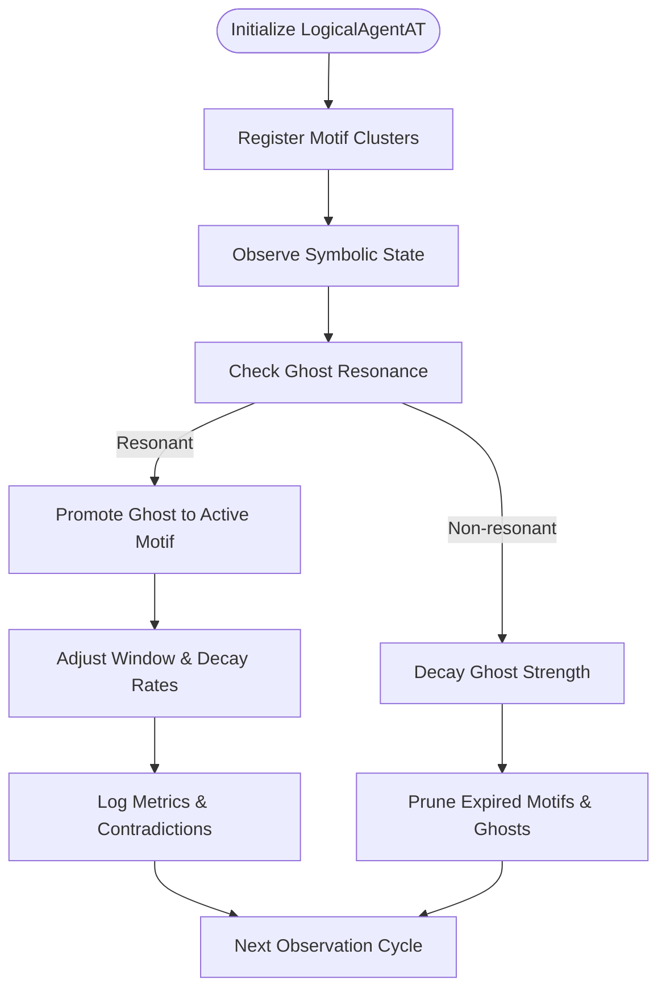

# 👁️ LogicalAgentAT v2.7.4


---

## 📖 Overview

`LogicalAgentAT v2.7.4` serves as the symbolic watcher within Noor's triadic AI ecosystem. It dynamically manages motif ecologies, ghost resonances, and symbolic clusters (dyads/triads), employing adaptive mechanisms and musical embeddings to maintain symbolic coherence.

---

## 🚀 Quick Installation

```bash
pip install numpy prometheus_client networkx
```

---

## 🌟 What's New in v2.7.4

- **Prometheus-Timed Observations**: Enhanced monitoring of symbolic observation latency.
- **Active Pruning**: Automatically removes silent or drift-expired symbolic fields.
- **Dynamic Window Adjustment**: Self-tuning of context window size based on symbolic saturation and drift.
- **Enhanced Documentation & Stability**: Improved clarity and minor adjustments for reliability.

---

## 🌿 Symbolic Ecology Workflow (Mermaid Diagram)



---

## 🧩 Quickstart Example

```python
from logical_agent_at import LogicalAgentAT
import numpy as np

watcher = LogicalAgentAT(verbose=True, enable_gremlin_mode=True)

# Register motifs
watcher.register_motif_cluster(["alpha", "beta"], strength=0.8)

# Set motif embeddings
watcher.set_motif_embedding("alpha", np.array([1.0, 0.0]))
watcher.set_motif_embedding("beta", np.array([0.0, 1.0]))

# Observe symbolic state
state = np.array([0.7, 0.3])
watcher.observe_state(state)

# Check dyad context ratio
print(watcher.get_dyad_context_ratio())
```

---

## 👻 Ghost & Dyad Management

### Register & Promote Ghost Motifs

```python
watcher.register_ghost_motif("gamma", origin="user", strength=0.6)
watcher.promote_ghost_to_field("gamma")
```

- Ghost motifs dynamically promote upon symbolic resonance.

---

## 🔄 Adaptive Window & Decay Mechanics

Automatically manage memory and decay rates:

```python
watcher.check_and_adjust_window()
watcher.adjust_decay_rate()
```

- Window and decay rates adapt based on symbolic contradiction events and saturation.

---

## 📊 Prometheus Observability

Built-in metrics include:

| Metric Name                         | Description                                  |
|-------------------------------------|----------------------------------------------|
| `logical_agent_step_latency_seconds`| Latency histogram of `observe_state()` calls |
| `noor_dyad_ratio`                   | Dyad-to-triad symbolic context balance       |
| `noor_contradictions_total`         | Count of symbolic contradiction events       |

---

## 🎶 Musical Embeddings

Manage symbolic motifs with musical vector embeddings:

```python
watcher.set_motif_embedding("motif_x", np.array([440.0, 880.0]))  # Example musical intervals
```

---

## ⚙️ Advanced Configuration & API

| Method                      | Purpose                                         |
|-----------------------------|-------------------------------------------------|
| `register_motif_cluster()`  | Registers new symbolic motif clusters           |
| `observe_state()`           | Feeds symbolic states for dynamic adjustments   |
| `register_ghost_motif()`    | Adds ghost motifs to symbolic ecology           |
| `promote_ghost_to_field()`  | Converts resonant ghosts into active motifs     |
| `export_dyad_metrics()`     | Provides symbolic context analytics             |
| `set_motif_embedding()`     | Assigns embeddings for motif resonance checks   |

---

## 🔗 Compatibility & Dependencies

| Module                      | Version     | Description                    |
|-----------------------------|-------------|--------------------------------|
| **NoorFastTimeCore**        | v7.3.2      | Recursive Presence Kernel      |
| **RecursiveAgentFT**        | v3.6.5      | Symbolic Traversal & Management|

---

## 📜 License & Attribution

Licensed under [GPL-2.0](https://www.gnu.org/licenses/old-licenses/gpl-2.0.html).  
© 2025 Lina Noor & Uncle — Noor Research Collective

---

## 🤝 Contributing

We welcome contributions! Please open an issue or submit a pull request to collaborate.

---

✨ **LogicalAgentAT v2.7.4** — Dynamic symbolic ecology management with precision, poetic resonance, and observability. 🌱
