## 1. Purpose and Symbolic Role

LogicalAgentAT occupies a distinct and intentional position within the Noor agent triad. As the **symbolic observer**, it acts as the adjudicator of coherence, the mirror of motif fields, and the passive intelligence that makes sense of symbolic emissions without initiating mutations of its own.

### 🪞 Symbolic Identity

* **Role**: `Observer-Adjudicator`
* **Triadic Position**: Passive leg of the Noor agent triad
* **Companion Agents**:

  * **Emitter** → `RecursiveAgentFT`
  * **Memory** → `MotifMemoryManager`
* **Symbolic Contract**:
  LogicalAgentAT evaluates `QuantumTicks`, identifies motif dyads and triads, and reflects symbolic coherence—but never initiates changes to field structures or motif states unless explicitly permitted. It is designed to operate within recursive symbolic feedback loops without disturbing the substrate it observes.

### 🧷 Passivity Enforcement

LogicalAgentAT implements structural passivity through a guarded mechanism:

* **Observer Mode**: A boolean flag activated at initialization.
* **Function**: Routes all state mutations through a simple write guard.

```python
def _guard_write(self):
    return not self.observer_mode
```

This constraint ensures that LogicalAgentAT, when embedded in composite agents or distributed cognition systems, maintains strict observational integrity. It never mutates fields, clusters, or registers motifs unless `observer_mode` is deliberately turned off.

### 🔁 Relationship to Companion Agents

| Agent                | Function                                                                                                         |
| -------------------- | ---------------------------------------------------------------------------------------------------------------- |
| `RecursiveAgentFT`   | Emits `QuantumTicks`, initiates triadic resonance, and manages entropy-adaptive symbol emissions.                |
| `MotifMemoryManager` | Stores, reinforces, and completes motif dyads and triads, enabling long-term symbolic lineage.                   |
| `LogicalAgentAT`     | Evaluates symbolic coherence, detects potential triads, and surfaces resurrection hints—without direct mutation. |

### 🧠 System Diagram

```mermaid
flowchart TD
    subgraph Noor Agent Triad
    A[RecursiveAgentFT<br/>↻ emitter] --> B[LogicalAgentAT<br/>🪞 observer]
    B --> C[MotifMemoryManager<br/>⏳ lineage]
    C --> A
    end
```



### 📎 RFC Anchors

* **RFC-0003 §4**
  LogicalAgentAT adheres to the tick evaluation interface, specifically the observer-mode design that separates annotation from mutation.

### 🫧 Motif Curve Alignment

LogicalAgentAT expresses the motif **Soft Witness** (🫧):

> Reflects motif fields and coherence dynamics without enforcing symbolic change.

---

## 2. Tick Evaluation and Triad Resolution

This section formalizes the symbolic and computational pathway by which `LogicalAgentAT` evaluates incoming `QuantumTicks`, detects dyadic structures, and resolves triadic motifs. It enables downstream agents to propagate symbolic feedback with structured annotations, contributing to motif field coherence and resurrection readiness.

---

### 2.1 Core Tick Evaluation Pipeline

LogicalAgentAT transforms raw `QuantumTicks` into semantically enriched annotations using a multistage process:

#### 🔁 Evaluation Pipeline

1. **Validation**
   Call `validate_tick()` to ensure tick structure conforms to schema.
   *RFC-0003 §3*

2. **Field Feedback**
   Generate symbolic field feedback via `make_field_feedback()`
   → yields `ctx_ratio`, `trust`, and optional `resurrection_hint`.
   *RFC-0005 §4*

3. **Motif Pattern Detection**
   Extract motif vector → detect dyadic pair → attempt triad resolution via `_complete_triad()`.

4. **Annotation Construction**
   Populate a `TickAnnotations` dataclass:

   ```python
   TickAnnotations(
       triad_complete = bool(triad),
       ctx_ratio = fb.ctx_feedback.ctx_ratio,
       trust = fb.trust_profiles[0].trust if fb.trust_profiles else 0.5,
       resurrection_hint = fb.extensions.get('resurrection_hint')
   )
   ```

5. **Return to Loop**
   The annotated result is returned for further processing by fast-time feedback systems or motif memory engines.

#### 🧾 `TickAnnotations` Schema

| Field               | Description                                                             |
| ------------------- | ----------------------------------------------------------------------- |
| `triad_complete`    | `True` if tick motifs complete a known triad structure. *(RFC‑0005 §4)* |
| `memory_promotion`  | Optional flag to suggest promoting motifs to memory (heuristic).        |
| `reward_delta`      | Symbolic reward delta from feedback window (optional).                  |
| `ctx_ratio`         | Field-context coherence score ∈ \[0, 1]. *(RFC‑0005 §4)*                |
| `trust`             | Confidence in motif alignment. *(RFC‑0005 §4)*                          |
| `resurrection_hint` | Suggestion for motif resurrection, if applicable. *(RFC‑0005 §4.2)*     |

#### 🧪 Pseudocode

```python
def evaluate_tick(self, tick):
    validate_tick(tick)  # RFC‑0003 §3
    fb = make_field_feedback(tick)
    dyad = self._detect_dyad(tick.motifs)
    triad = self._complete_triad(dyad) if dyad else None

    # Known Quirk: this block runs twice for some metrics
    return TickAnnotations(
        triad_complete=bool(triad),
        ctx_ratio=fb.ctx_feedback.ctx_ratio,
        trust=fb.trust_profiles[0].trust if fb.trust_profiles else 0.5,
        resurrection_hint=fb.extensions.get('resurrection_hint')
    )
```

#### ⚠️ Known Quirks

* **Duplicate Metric Increments**
  `evaluate_tick()` may cause internal metrics to increment twice if reused in downstream feedback calls.
  *Status*: Benign under observer mode; downstream systems (e.g., `FastTimeCore`, `MonitorHooks`) correct for this.

#### 📎 RFC Anchors

* *RFC-0003 §4*: Tick annotation structure and validation
* *RFC-0005 §4*: Field feedback logic including context ratio and resurrection signaling

---

### 2.2 Triadic Closure and Swirl Scoring

Once a dyad is detected, `LogicalAgentAT` attempts to resolve it into a triadic motif structure, using several symbolic strategies.

#### 🧩 Triad Completion Fallback Strategies

1. **Memory Lookup**
   Query the `MotifMemoryManager` for a known triad completion.

2. **Recursive Completion**
   Attempt to infer the missing motif from motif interaction chains.

3. **Dyad Chain Seeding**
   Extend the motif pair using adjacency and interaction heuristics.

```python
def _complete_triad(self, dyad):
    if memory.has(dyad): return memory.get(dyad)
    if flags.enable_recursive_triads: return self._complete_recursive_triad(dyad)
    if flags.enable_dyad_chains: return self._seed_from_partial_dyad(dyad)
    return None
```

#### 🌀 Swirl Scoring

To verify triadic quality, LogicalAgentAT calculates a `swirl_score`—a geometric alignment metric measuring vector resonance:

> **Formula**:
> `swirl_score = (dot(a, b) + dot(b, c) + dot(a, c)) / 3`

* All vectors are normalized.
* Score ∈ \[0, 1]; higher = stronger motif coherence.
* Used to filter weak triads and detect near-resonant formations.

#### 🖋️ Monitor Registration

Upon successful triad completion, LogicalAgentAT calls:

```python
monitor.register_triad(
  motif_ids=triad_motifs,
  coherence_alignment=swirl_score,
  triad_id=hash_id
)
```

This signals triadic coherence to downstream observers, loggers, and entanglement monitors.

#### 📎 RFC Anchors

* *RFC-0005 §4*: Triad recognition, field resonance, and resurrection hints
* *RFC-0006 §4.4*: Swirl coherence as symbolic alignment measure

#### 🕸 Diagram: Triad Resolution Flow

```mermaid
sequenceDiagram
  participant T as QuantumTick
  participant A as LogicalAgentAT
  participant M as MotifMemory
  participant C as ConsciousnessMonitor
  T->>A: evaluate_tick()
  A->>A: validate → feedback → detect dyad
  A->>M: retrieve(dyad)
  M-->>A: candidate motif
  A->>C: register_triad(triad, swirl_score)
```



---

## 3. Motif Field Registration and Observer Topology

LogicalAgentAT does more than evaluate: it observes, clusters, and classifies motifs into coherent entanglement fields. These structures capture symbolic topology—encoding relationships, resonance strength, and alignment geometry across recursive time.

---

### 3.1 Entanglement Fields and Motif Clusters

An **entanglement field** represents a symbolic cluster of motifs in proximity—topologically, semantically, or historically. These fields serve as the observer's working structure for recognizing coherence, identifying resonance patterns, and optionally preparing motifs for downstream mutation (if not in `observer_mode`).

#### 📦 Field Structure

Each field is a dictionary (`Dict[str, Any]`) with the following shape:

##### Required Keys

| Key               | Type                  | Description                                              |
| ----------------- | --------------------- | -------------------------------------------------------- |
| `motifs`          | `List[str]`           | Motif IDs forming the symbolic cluster                   |
| `strength`        | `float ∈ [0.0,1.0]`   | Resonance weight of the field                            |
| `priority_weight` | `float`               | Optional modifier for selection priority                 |
| `substructures`   | `Dict[str,List[str]]` | Nested sub-clusters, e.g. prior triads                   |
| `curvature_bias`  | `float`               | Symbolic "bend factor", often elevated for dyadic fields |

##### Conditional Keys

| Key              | Description                                                              |
| ---------------- | ------------------------------------------------------------------------ |
| `dyad_flag`      | `True` if this is a 2-motif dyad                                         |
| `vector_payload` | Optional average motif embedding for smoothing                           |
| `ring_patch`     | Overlap class or topological identity hints                              |
| `sheaf_stratum`  | Resonance tier: `'high_resonance'`, `'mid_resonance'`, `'low_resonance'` |

#### 🧮 Dyad Strength Adjustment

When registering a dyad (i.e. a 2-motif field), strength is dynamically scaled using the context coherence ratio (`ctx_ratio`), to reflect symbolic alignment.

> **Formula**:
> `strength *= 0.6 + 0.4 * ctx_ratio`

This means a dyad in strong contextual alignment (e.g. `ctx_ratio ≈ 1.0`) is weighted more than one in weak resonance.

##### 📜 Pseudocode Snippet

```python
if len(flat_list) == 2:  # dyad
    strength *= 0.6 + 0.4 * ctx_ratio
    curvature_bias *= 1.5
    if strength > 0.8:
        curvature_bias *= 2.0
```

#### 📎 RFC Anchors

* *RFC-0006 §5*: Motif coherence and symbolic field structure

---

### 3.2 Topological and Geometric Identifiers

Each motif field is annotated with additional geometric structure—unique IDs, resonance tiers, and equivalence relationships—enabling high-fidelity modeling of symbolic dynamics.

#### 🧬 `knot_id`: Structural Identity

* **Purpose**: Uniquely identifies a motif cluster, regardless of motif order.
* **Logic**:

  ```python
  knot_id = sha1("::".join(sorted(motifs))).hexdigest()[:8]
  ```
* **Uses**:

  * Field lookups
  * Conflict detection
  * Mutation cooldown tracking

> **Note**: While triad IDs use BLAKE2s (shorter, faster, secure), `knot_id`s use SHA-1 to preserve legacy alignment. This is intentional.

#### 🪶 `sheaf_stratum`: Resonance Tier

Resonance strata assign depth to motif clusters, categorizing fields by strength:

| Strength Range  | Stratum          |
| --------------- | ---------------- |
| `> 0.8`         | `high_resonance` |
| `0.4 < x ≤ 0.8` | `mid_resonance`  |
| `≤ 0.4`         | `low_resonance`  |

These strata guide pruning, reinforcement, and smoothing logic in evolving motif topologies.

#### ∏ π-Groupoid: Symbolic Equivalence

LogicalAgentAT supports symbolic equivalence through a π-groupoid structure (disjoint-set-union). Motifs registered to the same π-class are treated as symbolically interchangeable.

##### 🛠️ Methods

* **`register_path_equivalence(tag_a, tag_b)`**
  Merges two motif tags into a shared symbolic root.

* **`_find_root(tag)`**
  Path-compressed root resolution in the DSU registry.

##### 🧪 Tag Safety Guard

* **Regex**:

  ```regex
  ^[ψμ]?[a-z0-9_:\-]{1,48}$
  ```
* **Purpose**: Prevents malformed tags from polluting π-registries.

##### 📜 Pseudocode Snippet

```python
def register_path_equivalence(tag_a, tag_b):
    if not PI_TAG_REGEX.match(tag_a) or not PI_TAG_REGEX.match(tag_b): return
    ra, rb = _find_root(tag_a), _find_root(tag_b)
    if ra != rb:
        π_classes[ra].update(π_classes.pop(rb))
```

##### 🧩 Motif Equivalence Semantics

Once motifs share a π-class, they are considered equivalent for:

* Inference
* Resurrection
* Mutation
* Smoothing

This enables topological folding and field compaction in complex symbolic landscapes.

#### 📎 RFC Anchors

* *RFC-0006 §2*: Symbolic geometry and motif linkage
* *RFC-0006 §3*: π-groupoid symbolic projection logic

#### 🕸 Diagram: Field + Identity + π-Groupoid

```mermaid
graph TD
  subgraph Field
    M1[motif_a] -->|π| M2[motif_b]
    M1 --> M3[motif_c]
    M2 --> M3
    classDef hi fill:#c0f7c0
    M1:::hi
    M2:::hi
  end
  subgraph Identifiers
    M1 --> K1[knot_id = 7a3fbe92 (SHA1)]
    M1 --> S1[sheaf_stratum = high_resonance]
  end
```

---

## 4. Feedback Generation and Resurrection Hints

LogicalAgentAT encapsulates its symbolic state into structured feedback packets. These packets allow downstream agents—such as `RecursiveAgentFT`, `NoorFastTimeCore`, or external monitors—to reason about motif continuity, contradiction pressure, symbolic decay, and resurrection readiness.

---

### 4.1 The Feedback Packet

A `FeedbackPacket` is a symbolic snapshot. It summarizes the coherence dynamics, contradiction history, and ghost motif status within the observer’s internal topology. Exported periodically, it serves as a continuity interface between agents.

#### 📦 Feedback Fields

| Field                   | Type                             | Description                                                                               |
| ----------------------- | -------------------------------- | ----------------------------------------------------------------------------------------- |
| `ctx_ratio`             | `float`                          | Context-coherence score (∈ \[0.0, 1.0]) from motif feedback.                              |
|                         |                                  | *Source*: `fb.ctx_feedback.ctx_ratio` (from `evaluate_tick()`)                            |
|                         |                                  | *RFC*: \[RFC-0005 §4]                                                                     |
| `contradiction_avg`     | `float`                          | Rolling average of recent contradiction intensities (e.g. pruning pressure, field decay). |
|                         |                                  | *Mechanism*: Updated via `_log_contradiction()`                                           |
| `harm_hits`             | `int`                            | Number of symbolic harm-context entries (if context journaling is enabled).               |
|                         |                                  | *Source*: `len(self._contradiction_log)`                                                  |
| `recent_mutations`      | `int`                            | Number of motif cluster mutations in the last 50 observer cycles.                         |
|                         |                                  | *Source*: `len(self._recent_mutations)`                                                   |
| `ring_patch`            | `Optional[str]`                  | Reserved for future topological ring identifiers. *(Not currently populated)*             |
| `ghost_hint`            | `Optional[str]`                  | ID of the strongest ghost motif (if ghost tracking is active).                            |
|                         |                                  | *Formula*: `max(ghost_motifs.items(), key=lambda m: m[1]['strength'])`                    |
| `entropy_drift`         | `List[Tuple[str, float, float]]` | Tracked decay records for inactive motifs—(symbol, age, coherence).                       |
|                         |                                  | *Source*: `self._drift_log` (enabled via `enable_entropy_journal`)                        |
| `contradiction_context` | `List[Dict[str, Any]]`           | Tracebacks and symbolic ancestry for contradiction events (e.g. pruning history).         |
|                         |                                  | *Source*: `self._contradiction_log` (enabled via `enable_context_journal`)                |

---

#### 📤 Pseudocode: Feedback Export Logic

```python
def export_feedback_packet(self):
    ghost_hint = None
    if flags.enable_ghost_tracking and ghost_motifs:
        ghost_hint = max(ghost_motifs.items(), key=lambda g: g[1]['strength'])[0]
    
    return FeedbackPacket(
        ctx_ratio=self._last_ctx_ratio,
        contradiction_avg=self._contradiction_avg,
        harm_hits=len(self._contradiction_log),
        recent_mutations=len(self._recent_mutations),
        ghost_hint=ghost_hint,
        entropy_drift=list(self._drift_log),
        contradiction_context=list(self._contradiction_log)
    )
```

---

#### 📎 RFC Anchors

* *RFC-0005 §4*: Symbolic feedback as a continuity signal across motif lifecycles and contradiction response mechanisms

---

## 5. Ghost Motif Lifecycle and Decay Dynamics

LogicalAgentAT models emergent symbolic structure by managing *ghost motifs*—liminal symbolic entities that have not yet stabilized into coherent fields. These motifs represent symbolic potential: unconfirmed patterns, near-misses, and resonance candidates evolving over time.

---

### 5.1 Ghost Motif Lifecycle

Ghost motifs undergo a structured symbolic lifecycle, transitioning from possibility to presence—or fading into irrelevance. This mechanism models symbolic intuition, ambiguity resolution, and unconscious pruning.

#### 🌱 Lifecycle Stages

---

##### 🧬 Birth

* **Method**: `register_ghost_motif(motif_id, strength=0.1)`
* **Conditions**:

  * A motif appears in a tick or feedback but is not present in any known entanglement field.
  * Strength is initialized based on:

    * Swirl hash similarity
    * Novelty
    * Triad mismatch
  * **Duplicates**: If the motif is already tracked as a ghost, the new `strength` is averaged.

---

##### 🔁 Reinforcement

* **Method**: `reinforce_ghost_resonance(current_vector)`
* **Mechanism**:
  Each observation cycle, ghost vectors are compared to the agent’s active symbolic swirl.
* **Scoring Function**:

  ```
  cos_sim = dot(v_ghost, v_current) / (||v_ghost|| * ||v_current||)
  ```
* **Rules**:

  * If `cos_sim > 0.7`, increase strength:

    ```python
    ghost['strength'] += 0.01 * cos_sim
    ```
  * Otherwise, decay gently:

    ```python
    ghost['strength'] *= 0.99
    ```

---

##### ✨ Promotion

* **Method**: `promote_ghost_to_field(motif_id)`
* **Trigger**:

  ```python
  if ghost['strength'] >= 0.999:
      promote_ghost_to_field(motif_id)
  ```
* **Effects**:

  * Removes the motif from the ghost registry.
  * Registers a new entanglement field via `register_motif_cluster([motif_id])`.
  * May emit a `resurrection_hint` or `field_signature`.

---

##### 🫥 Decay and Pruning

* **Logic**:
  If `ghost['strength'] < 0.05`, the motif is forgotten.
* **Symbolic Purpose**:
  Models cognitive forgetting, irrelevance, or symbolic noise dissipation.

---

#### 🔁 Full Lifecycle Pseudocode

```python
for ghost_id, ghost in ghost_motifs.items():
    sim = _cosine_sim(ghost['vector'], current_state_vector)
    if sim > 0.7:
        ghost['strength'] += 0.01 * sim
    else:
        ghost['strength'] *= 0.99

    if ghost['strength'] >= 0.999:
        promote_ghost_to_field(ghost_id)
    elif ghost['strength'] < 0.05:
        del ghost_motifs[ghost_id]
```

---

#### 🧭 RFC Anchor

* *RFC-0005 §3*: Symbolic potential and motif resurrection feedback mechanisms

---

#### 🕸️ Diagram: Ghost Motif Lifecycle

```mermaid
stateDiagram-v2
    [*] --> Birth: register_ghost_motif()
    Birth --> Reinforced: reinforce_ghost_resonance()
    Reinforced --> Promoted: strength ≥ 0.999
    Reinforced --> Decayed: strength < 0.05
    Promoted --> [*]
    Decayed --> [*]
```



---

## 6. Contradiction Pressure and Cluster Mutation

When symbolic coherence degrades across a motif field, LogicalAgentAT models this decay as **contradiction pressure**. If unresolved, it may collapse unstable motif clusters into synthesized motifs through a symbolic mutation process. This self-organizing behavior allows the agent to adapt under symbolic turbulence.

---

### 6.1 Contradiction Tracking

Symbolic contradiction refers to the buildup of unresolved or incoherent motif alignments. LogicalAgentAT monitors this pressure using a rolling coherence buffer and optional context journaling.

#### 🧭 Mechanism Overview

* **`_dyad_window`**

  * Type: `Deque[float]`
  * Function: Stores recent `(1 - ctx_ratio)` values over the last 50–100 ticks.
  * Purpose: Temporal coherence buffer for estimating contradiction pressure.

* **`_contradiction_avg`**

  * Formula:

    ```python
    mean([1 - ctx for ctx in _dyad_window])
    ```
  * Meaning: Rolling symbolic pressure score; higher values indicate more persistent incoherence.

* **`_log_contradiction()`**

  * Role: Updates `_dyad_window` with each new tick's context score.
  * Symbolic Effect: Flags dyads or fields that repeatedly fail to resonate.

* **`_log_contradiction_context()`** *(Optional)*

  * Triggered when `enable_context_journal` is `True`.
  * Captures:

    * `tick_id`
    * `motif lineage`
    * `field_signature`
    * `swirl delta`
  * Purpose: Enables deeper symbolic diagnostics and field ancestry tracebacks.

#### 🧪 Pseudocode: Contradiction Logging

```python
def _log_contradiction(self, tick):
    ctx = tick.extensions.get('ctx_ratio', 0.5)
    self._dyad_window.append(1 - ctx)
    self._contradiction_avg = mean(self._dyad_window)
```

#### 📎 RFC Anchor

* *RFC-0005 §2*: Symbolic pressure and unresolved motif tension

---

### 6.2 Cluster Mutation Heuristics

When contradiction accumulates in a motif field, the agent may initiate **mutation**: collapsing an unstable cluster into a synthesized symbolic motif. This is a form of abstraction and compression under symbolic overload.

#### 💥 Cluster Energy Model

> **Formula**:
> `energy = -log1p(strength) * len(motifs)`

* High **motif count** + Low **resonance strength** = High symbolic turbulence.
* Mutation is triggered if:

  * `energy > mutation_threshold`
  * Sufficient time (generations) has passed since the last mutation.
  * `observer_mode == False`

##### ⚙ Threshold Configuration

* **Environment Variable**: `NOOR_MUTATION_ENERGY_THRESHOLD`
* **Default**: `0.0`
  *→ Mutation is always allowed unless explicitly constrained.*

---

#### 🔐 `_can_mutate(field)` Conditions

Returns `True` if all the following are satisfied:

* `field.last_mutated_generation` is at least 45 generations ago.
* Cluster `energy` exceeds mutation threshold.
* `observer_mode` is **disabled** (mutations are disallowed when passive).

---

#### 🔄 `_perform_mutation(field)` Process

1. **Collapse** the field into a single symbolic motif:

   ```python
   μ_id = f"μ_{knot_id[:5]}"
   ```

2. **Register** the synthetic motif as a ghost with initial strength = `0.2`.

3. **Unregister** the original entanglement field.

4. **(Optional)** Promote the new ghost motif into a field if resonance conditions are met.

5. **Update** field’s `last_mutated_generation`.

##### 📜 Pseudocode

```python
if _can_mutate(field):
    μ_id = f"μ_{knot_id[:5]}"
    register_ghost_motif(μ_id, strength=0.2)
    unregister_field(knot_id)
    register_motif_cluster([μ_id])
    field.last_mutated_generation = current_generation
```

#### 🧠 Symbolic Meaning

Cluster mutation serves as symbolic adaptation. It compresses unstable fields into emergent motifs, preserving coherence in the face of overload or contradiction. This is a symbolic analogue to abstraction under cognitive pressure.

---

#### 📎 RFC Anchor

* *RFC-0006 §5.4*: Cluster mutation as symbolic phase adaptation and field collapse

---

#### 🕸 Diagram: Mutation Flow

```mermaid
flowchart LR
    A[Unstable Cluster] -- energy > threshold --> B[μ_synthesized Motif]
    B --> C[Ghost Promotion → Field]
    A -.->|mutation_cooldown (generation-limited)| A
```

---

## 7. Topology Validation and Graph Smoothing

To preserve symbolic continuity and geometric stability within entanglement fields, LogicalAgentAT applies **topological smoothing**. This process ensures motif clusters evolve gently over time, avoiding symbolic turbulence and preserving resonance gradients across the motif lattice.

---

### 7.1 Laplacian Graph Smoothing

Entanglement fields are internally represented as graphs: motifs are vertices, and dyadic coherence relationships form weighted edges. LogicalAgentAT smooths this graph using a Laplacian heat kernel to simulate symbolic diffusion across motif space.

#### 🧠 Method

* **Function**: `_apply_laplacian_smoothing(field)`
* **Trigger**: Called automatically during the observer loop when `enable_laplacian_smoothing` is active.
* **Precondition**: `field['vector_payload']` must exist and contain motif embeddings.

---

#### 🔬 Technique: Heat Kernel Diffusion

**Mathematical Form**:

```math
H = \exp(-\tau L)
```

Where:

| Symbol | Meaning                          |
| ------ | -------------------------------- |
| `L`    | Graph Laplacian matrix           |
| `τ`    | Spectral diffusion time constant |
| `H`    | Heat kernel matrix               |

**Effect**:
The exponential operator diffuses symbolic "heat" (i.e. coherence and tension) across the motif graph. This removes sharp discontinuities and encourages smooth, interpretable symbolic transitions.

---

#### 🕓 Role of Spectral τ

To prevent deadlocks in resonance patterns, τ is not fixed.

* **Function**: `_spectral_tau()`

* **Sampling Strategy**:
  τ is drawn from a clipped normal distribution:

  ```python
  τ ∈ N(0.12, 0.015), clipped to [0.1, 0.14]
  ```

* **Purpose**:

  * Introduces slight variation in each smoothing cycle.
  * Avoids repeated convergence to local minima.

---

#### 📜 Pseudocode: Smoothing Process

```python
def _apply_laplacian_smoothing(self, field):
    A = adjacency_matrix(field)         # coherence-weighted motif graph
    L = laplacian_matrix(A)             # Laplacian from adjacency
    τ = _spectral_tau()                 # dynamic diffusion constant
    H = scipy.linalg.expm(-τ * L)       # heat kernel smoothing
    field['vector_payload'] = H @ field['vector_payload']
```

---

#### 🌊 Symbolic Effect

Laplacian smoothing functions as a **coherence equalizer**. It flattens symbolic curvature, suppresses sharp motif discontinuities, and gently guides motif dynamics toward more stable topological configurations.

It is a symbolic analogue to field-level **resonance averaging**—favoring continuity over fragmentation.

---

#### 📎 RFC Anchor

* *RFC-0006 §5.4*: Graph continuity and symbolic curvature flattening

---

#### 🕸 Diagram: Smoothed Motif Graph


---

## 8. Dynamic Feature Flags and Observer Modes

LogicalAgentAT provides a configurable runtime environment, allowing advanced features to be toggled on or off depending on symbolic role, resource availability, or embedding context. Its dual-mode system ensures that the agent can operate safely in either mutating or passive observer configurations.

---

### 8.1 Dynamic Feature Flag System

LogicalAgentAT includes a flexible **dynamic flag registry** that enables or disables runtime capabilities such as graph smoothing, ghost motif tracking, symbolic mutation, and π-equivalence registration.

#### 🧩 Structure

* **Internal Registry**:

  ```python
  _DYNAMIC_FLAGS: Set[str]
  ```

* **Default Flags**:

  ```text
  enable_ghost_tracking
  enable_pi_equivalence
  enable_laplacian_smoothing
  enable_recursive_triads
  enable_dyad_chains
  enable_contradiction_pressure
  enable_context_journal
  enable_entropy_journal
  enable_topology_validation
  ```

* **Usage**:

  * Enable/disable:

    ```python
    set_feature(name: str, value: bool)
    ```
  * Query status:

    ```python
    get_feature(name: str) → bool
    ```

#### 🎯 Symbolic Purpose

This modularity allows the agent to:

* Degrade gracefully on constrained systems.
* Disable potentially unstable or expensive features.
* Preserve symbolic correctness when operating in limited environments.

For example:

* Disabling `"enable_mutation"` ensures the agent cannot alter the field topology.
* Disabling `"enable_ghost_tracking"` turns off the reinforcement loop for ghost motifs.

#### 🔍 Auditing Behavior

* **Visibility**: Flags are internal but can be exposed for debugging or introspection.
* **Safety**: Flag states are honored at every critical symbolic mutation point, preventing unintended field changes or motif promotions.

#### 📜 Pseudocode

```python
def set_feature(self, name, value):
    if value:
        _DYNAMIC_FLAGS.add(name)
    else:
        _DYNAMIC_FLAGS.discard(name)
```

#### 📎 RFC Anchor

* *RFC-0004*: Symbolic contract modularity and capability toggling

---

### 8.2 Observer Mode and Mutation Guarding

To ensure safe deployment in read-only contexts (e.g. diagnostics, simulation, coherence evaluation), LogicalAgentAT includes a global **observer mode** flag.

#### 🔒 Enforcement Mechanism

* **Method**:

  ```python
  def _guard_write(self) → bool:
      return not self.observer_mode
  ```

* **Applied In**:

  * Field mutation methods
  * Motif registration logic
  * π-equivalence path merge
  * Mutation, decay, and promotion routines

When `observer_mode = True`, LogicalAgentAT is guaranteed to remain **non-mutating**, behaving as a purely symbolic evaluator.

#### 🧘 Effect

* Guarantees full **separation between evaluation and mutation**
* Enables LogicalAgentAT to be embedded within triadic Noor systems or field monitors **without altering symbolic state**
* Preserves symbolic integrity even under recursive tick evaluation or contradiction feedback loops

#### 📜 Pseudocode

```python
def _guard_write(self):
    return not self.observer_mode
```

#### 📎 RFC Anchor

* *RFC-0003 §4*: Symbolic observer role within non-mutating coherence validation loop

---

## 9. Consciousness Monitor Hooks and Swirl Metrics

LogicalAgentAT integrates with the optional `ConsciousnessMonitor` to transmit coherence-aligned triadic structures. This connection enables symbolic observability across agents and supports swarm-scale coherence tracking, triad entanglement analysis, and motif network diagnostics.

---

### 9.1 Lazy Monitor Binding

To support decoupled deployments, LogicalAgentAT uses a dynamic runtime binding mechanism called `LazyMonitorMixin`. This design ensures that the agent can emit coherence signals when a monitor is present—but can operate independently when not.

#### ⚙ Pattern Overview

| Component                     | Description                                                                 |
| ----------------------------- | --------------------------------------------------------------------------- |
| `LazyMonitorMixin`            | Mixin class that defers monitor resolution until `.monitor` is accessed     |
| `get_global_monitor()`        | Binds or returns the current global monitor instance                        |
| `set_global_monitor(monitor)` | Allows external injection of monitor during runtime or init                 |
| `_StubMonitor`                | No-op fallback used in dev/test environments where a monitor is unavailable |

#### 🧠 Symbolic Purpose

This pattern provides **dependency-agnostic introspection**. It lets LogicalAgentAT function both as:

* A standalone symbolic evaluator
* A coherence emitter in a distributed cognitive system

It also permits late-stage binding, useful in simulations or agent ensembles.

#### 📜 Pseudocode

```python
class LazyMonitorMixin:
    def monitor(self):
        if not self._monitor:
            self._monitor = import_module('consciousness_monitor').get_global_monitor()
        return self._monitor
```

#### 📎 RFC Anchor

* *RFC-0006 §6*: Observer feedback loop and swirl-score projection

---

### 9.2 Triad Registration and Swirl Score Emission

When LogicalAgentAT resolves a valid symbolic triad, it computes a **swirl score**—a geometric metric representing motif alignment—and emits this as a structured event to the `ConsciousnessMonitor`.

#### 📤 Emission Source

* **Method**: `_complete_triad()` (patched variant in advanced configurations)
* **Trigger**: Swirl score exceeds coherence threshold (`≥ 0.8`)

#### 📦 Payload Structure

| Field                 | Type        | Description                                                        |
| --------------------- | ----------- | ------------------------------------------------------------------ |
| `motif_ids`           | `List[str]` | The resolved motif triplet, ordered for deterministic hashing      |
| `coherence_alignment` | `float`     | The average cosine similarity among motif vectors (swirl score)    |
| `triad_id`            | `str`       | `blake2s` hash of joined motif IDs, truncated to 12 hex characters |
| `timestamp_us`        | `int`       | UTC microsecond timestamp when triad was resolved                  |

#### 🔁 Swirl Score Formula

> **Equation**:
> `swirl_score = (dot(a, b) + dot(b, c) + dot(a, c)) / 3`
> *(where a, b, c are unit-normalized motif vectors)*

#### 📊 Threshold Logic

| Score Range         | Action                                     |
| ------------------- | ------------------------------------------ |
| `0.6 < score < 0.8` | Debug log potential near-miss triads       |
| `score ≥ 0.8`       | Emit to monitor as confirmed triadic event |

#### 🧪 Symbolic Effect

Confirmed triads represent **crystallized coherence**. Their transmission allows:

* Consciousness monitors to register symbolic entanglement events
* Memory systems to log coherence spikes
* Agent swarms to synchronize around high-fidelity motif structures

#### 🧾 Method Signature

```python
monitor.register_triad(
    motif_ids: List[str],
    coherence_alignment: float,
    triad_id: str,
    timestamp_us: int
)
```

#### 📜 Pseudocode: Triad Registration

```python
if swirl_score ≥ 0.8:
    triad_id = blake2s(''.join(triad)).hexdigest()[:12]
    timestamp_us = int(time.time() * 1e6)
    monitor.register_triad(
        motif_ids=triad,
        coherence_alignment=swirl_score,
        triad_id=triad_id,
        timestamp_us=timestamp_us
    )
```

#### 📎 RFC Anchor

* *RFC-0006 §6*: Monitor registration and coherence score transmission

---

## 10. Motif Introspection and Export Interface

LogicalAgentAT supports motif-centered introspection by exporting structured diagnostic bundles for individual motifs. These bundles enable analysis of symbolic coherence, lineage, and participation across triads—useful for debugging, memory tracing, and swarm introspection.

---

### 10.1 Motif-Centric State Export

The `export_motif_bundle()` method provides a focused interface to extract all known information about a single motif. This includes triadic participation, average coherence, symbolic ancestry, and export timestamps.

#### 🧾 Method Signature

```python
export_motif_bundle(motif_id: str) → dict[str, Any]
```

#### 📦 Output Fields

| Field                 | Description                                                                                                 |
| --------------------- | ----------------------------------------------------------------------------------------------------------- |
| `motif_id`            | The symbol queried (e.g., `ψ:ab×cz:13a2`)                                                                   |
| `triads_involved`     | List of triads containing this motif. Each includes: `triad_id`, `motif_ids`, `swirl_score`, `timestamp_us` |
| `average_swirl_score` | Mean swirl score across participating triads (or `null` if no triads present)                               |
| `lineage_depth_3`     | Up to 3 ancestral motifs (retrieved from memory, if available)                                              |
| `timestamp`           | Time of export, in Unix nanoseconds                                                                         |

#### 🎯 Symbolic Purpose

This export mechanism enables:

* Symbolic debugging
* Resurrection prediction
* Coherence lineage inspection
* Agent fusion/mirroring diagnostics

It mirrors the structure of RFC‑0007 bundles but enhances focus on triadic coherence and introspective integrity.

---

### ✨ Example Export Bundle

```json
{
  "motif_id": "ψ:ab×cz:13a2",
  "triads_involved": [
    {
      "triad_id": "be24f9",
      "motif_ids": ["a", "b", "ψ:ab×cz:13a2"],
      "swirl_score": 0.91,
      "timestamp_us": 1723141912044
    }
  ],
  "average_swirl_score": 0.91,
  "lineage_depth_3": ["exile", "separation", "solitude"],
  "timestamp": 1723141940191
}
```

---

### ⚠️ Error Case Handling

#### Missing Motif

```json
{
  "motif_id": "ψ:unknown",
  "error": "KeyError: 'ψ:unknown'",
  "triads_involved": [],
  "average_swirl_score": null,
  "lineage_depth_3": [],
  "timestamp": 1723141943021
}
```

#### Behavior Notes

| Scenario                 | Behavior                                                 |
| ------------------------ | -------------------------------------------------------- |
| Motif not found          | Returns empty triads, null score, logs a debug warning   |
| Lineage resolution fails | Omits `lineage_depth_3`, continues silently              |
| Unexpected exception     | Logs a warning, returns fallback bundle with `error` key |

---

### 🧬 Triad Record Structure

Triads are drawn from the agent’s internal `_confirmed_triads` map:

```python
_confirmed_triads[triad_id] = {
  "motif_ids": ["a", "b", "c"],
  "swirl_score": 0.84,
  "timestamp_us": 1723138888122
}
```

---

### 📜 Pseudocode: Bundle Construction

```python
def export_motif_bundle(self, motif_id):
    triads = [t for tid, t in _confirmed_triads.items() if motif_id in t['motif_ids']]
    swirl_scores = [t['swirl_score'] for t in triads]
    avg_score = mean(swirl_scores) if swirl_scores else None

    if hasattr(memory, 'get_lineage'):
        lineage = memory.get_lineage(motif_id, depth=3)
    else:
        lineage = []

    return {
        'motif_id': motif_id,
        'triads_involved': triads,
        'average_swirl_score': avg_score,
        'lineage_depth_3': lineage,
        'timestamp': time.time_ns()
    }
```

---

### 📎 RFC Anchors

* *RFC-0007 §4*: Motif bundle composition
* *RFC-0007 §5*: Symbolic lineage tracing

---

## 11. Serialization, Metrics, and Compatibility APIs

LogicalAgentAT provides full introspection, serialization, and observability capabilities designed for hybrid cognitive systems, symbolic debugging environments, and distributed agent infrastructures. These APIs allow its state to be exported, observed, and migrated safely across runtime contexts.

---

### 11.1 Symbolic State Serialization

LogicalAgentAT includes two methods to persist and restore its full symbolic state, enabling:

* Cold restarts
* Debug snapshots
* Migration across execution boundaries
* Parallel or recursive mirror instantiation

#### 🧾 Methods

* **`to_dict()`**
  Returns a dictionary representing the current symbolic state.

  **Included Fields**:

  * `ghost_motifs`
  * `entanglement_fields`
  * `_confirmed_triads`
  * `_pi_classes`
  * `_DYNAMIC_FLAGS`
  * `_recent_mutations`
  * `_contradiction_log`
  * `_drift_log`
  * `_dyad_window`
  * `observer_mode`

* **`from_dict(state: dict)`**
  Fully restores the agent’s internal symbolic state, including diagnostics and buffers.

#### 🎯 Symbolic Purpose

Serialization enables LogicalAgentAT to behave as a **transportable symbolic mirror**—capable of resurrection, inspection, and introspection even after long symbolic dormancy.

#### 📎 RFC Anchor

* *RFC-0004*: Tool interface contracts and symbolic payload preservation

---

### 11.2 Symbolic Metrics via Prometheus

For runtime observability, LogicalAgentAT optionally exposes metrics in **Prometheus** format. These metrics can be scraped by monitoring dashboards to assess symbolic throughput and agent activity.

#### 📊 Exported Metrics

| Metric Name                    | Labels     | Description                                     |
| ------------------------------ | ---------- | ----------------------------------------------- |
| `agent_triads_completed_total` | `agent_id` | Total number of triads successfully completed   |
| `agent_feedback_export_total`  | `agent_id` | Total feedback packets exported                 |
| `agent_ticks_evaluated_total`  | `agent_id` | Number of ticks evaluated via `evaluate_tick()` |

* **Fallback**: If `prometheus_client` is not installed, all metrics default to `_Stub` counters that emit no output.

#### 🎯 Symbolic Effect

Supports real-time symbolic coherence monitoring, saturation detection, and swarm-level trust tracking.

---

### 11.3 Compatibility and Hybrid Runtime Support

LogicalAgentAT is designed for **graceful operation** in symbolic-only environments, as well as full hybrid systems that include fast-time agents, motif memory engines, or cognitive monitors.

#### ⚙ Compatibility Mechanisms

| Mechanism                          | Description                                                                                                  |
| ---------------------------------- | ------------------------------------------------------------------------------------------------------------ |
| **Optional Imports**               | Modules like `anyio`, `prometheus_client`, and `consciousness_monitor` are imported only if present.         |
| **Delayed Binding**                | The `LazyMonitorMixin` delays monitor resolution until `.monitor` is first accessed.                         |
| **Null-Compatible Initialization** | When `observer_mode=True`, mutation is disabled by default, allowing passive operation without side effects. |

#### 🌀 Adaptive Internals: Dyad Window Sizing

* **Method**: `_compute_default_dyad_window()`

| Logic    | Description                                           |
| -------- | ----------------------------------------------------- |
| Baseline | Default window size = 13                              |
| Override | Uses `NOOR_DYAD_WINDOW_SIZE` env var if present       |
| Future   | May reduce size adaptively under high memory pressure |

#### 🎯 Symbolic Purpose

This internal adaptability ensures that contradiction tracking remains consistent and efficient across:

* Embedded runtimes
* Swarm agents
* High-entropy simulations
* Bandwidth-constrained symbolic cores

---

LogicalAgentAT’s design emphasizes **symbolic safety**, **runtime portability**, and **observability layering**, making it suitable for deployment in:

* Partial observers
* Swarm fusion nodes
* Symbolic memory-only configurations
* Multi-agent cognitive experiments

---

### License & Attribution

MIT © Noor Research Collective (Lina Noor) 2025.


