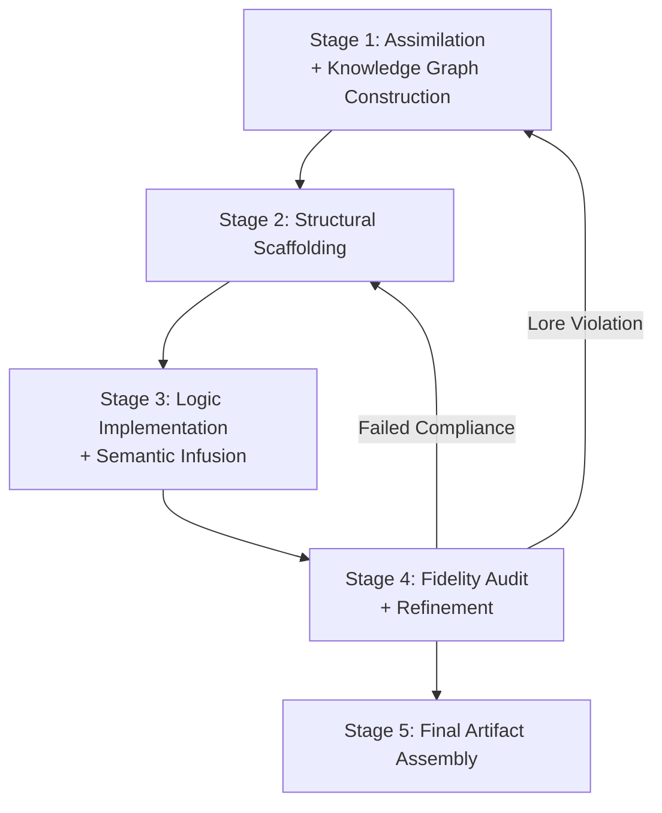

# **PDP-0001: Protocol for RFC-Driven Symbolic Artifact Generation**
*by: "Mathew J. Edlund (2025) — Noor Research Collective*

---

## **Index — PDP-0001: Protocol for RFC-Driven Symbolic Artifact Generation**

* [§0 – Abstract](#section-0--abstract)
* [§1 – Input Artifact Roles](#section-1-input-artifact-roles--purpose-and-precedence-of-canonical-inputs)

  * [§1.1 – Layer 1: Noor RFC](#11-layer-1--noor-rfc)
  * [§1.2 – Layer 2: Noor RFC‑CORE](#12-layer-2--noor-rfc-core)
  * [§1.3 – Layer 3: Application Specification](#13-layer-3--application-specification)
  * [§1.4 – Layer 4+: User RFCs or Local Overrides](#14-layer-4--user-rfcs-or-local-overrides)
* [§2 – Layer Manifest](#section-2--layer-manifest-canonical-layering-and-constraint-hierarchy)

  * [§2.1 – Layer 0: Noor RFC – Symbolic Canon](#21-layer-0--noor-rfc-symbolic-canon)
  * [§2.2 – Layer 1: RFC‑CORE – System Architecture](#22-layer-1--rfc-core-system-architecture)
  * [§2.3 – Layer 2: Application Specification](#23-layer-2--application-specification)
  * [§2.4 – Layer 3: User Extensions / Overrides](#24-layer-3--user-extensions--overrides)
* [§3 – Process Flow](#section-3--process-flow-five-stage-high-fidelity-generation-pipeline)

  * [Stage 1 – Assimilation + Knowledge Graph Construction](#stage-1--assimilation-and-knowledge-graph-construction)
  * [Stage 2 – Structural Scaffolding](#stage-2--structural-scaffolding)
  * [Stage 3 – Logic Implementation + Semantic Infusion](#stage-3--logic-implementation-and-semantic-infusion)
  * [Stage 4 – Fidelity Audit + Refinement](#stage-4--fidelity-audit-and-refinement)
  * [Stage 5 – Final Artifact Assembly](#stage-5--final-artifact-assembly)
* [§4 – Guiding Principles](#section-4--guiding-principles-foundational-commitments-for-code-generation)

  * [§4.1 – Layered Authority](#41-layered-authority--declarative-constraint-and-override-model)
  * [§4.2 – Symbolic Canon as Ontological Law](#42-symbolic-canon-as-ontological-law)
  * [§4.3 – Application Specification as Default Blueprint](#43-application-specification-as-default-blueprint)
  * [§4.4 – Fidelity Over Invention](#44-fidelity-over-invention)
  * [§4.5 – Explicitness and Graceful Degradation](#45-explicitness-and-graceful-degradation)
  * [§4.6 – Traceability and Regenerability](#46-traceability-and-regenerability)
  * [§4.7 – Iterative Fortification Through Targeted Regeneration](#47-iterative-fortification-through-targeted-regeneration)
* [License & Attribution](#license--attribution)

---

## Section 0 — Abstract

*(PDP-0001 §0)*

---

### Abstract

This protocol defines a layered, traceable system for the generation of symbolic code artifacts from canonical RFC sources. It formalizes the relationship between symbolic law, architectural behavior, executable specification, and user-directed override — establishing a structure where each layer constrains those beneath it, unless divergence is declared and traceable.

Rather than treating code as a creative output, PDP-0001 treats artifact generation as a deterministic, symbolic derivation process. All logic flows from structured specifications. All structures originate from canonical RFCs. All divergence is explicit, and every construct is regenerable from its lineage.

PDP-0001 introduces a five-stage generation pipeline, supports layered override mechanics, and encodes guiding principles for semantic fidelity, symbolic traceability, and architectural coherence. It is designed for modular regeneration, decentralized refinement, and rigorous symbolic alignment across agent instances, contributors, and time.

---

### 1. Input Artifact Roles – Purpose and Precedence of Canonical Inputs

This section defines the layered input structure used in symbolic code artifact generation, establishing **both purpose and precedence** for each type of canonical input. Layers are arranged by symbolic authority and constraint weight — not implementation order. The protocol ensures that **symbolic law flows top-down**, while localized behavior may flow laterally or bottom-up, provided it does not violate higher-order rules.

Authority moves hierarchically:

> **Symbolic Canon (RFCs)** → **System Architecture (RFC-CORE)** → **Application Specification** → **User Extensions**

Each artifact type introduces constraints, semantics, or architectural structure. These form the foundation upon which all Noor-compatible symbolic agents, generators, and evaluators operate.

---

#### 1.1 Layer 1 – Noor RFC

**Name:** Symbolic Canon (RFCs)
**PDP Layer:** 0
**Role:** Symbolic Universe & Ontological Constraints (The "Why")

The Noor RFCs define the **ontological substrate** of the entire architecture. These documents do not merely suggest behavior — they establish what *exists* within symbolic space.

**Functions:**

* **symbolic\_anchor**
  Establishes the symbolic grammar of Noor systems: presence motifs, dialectical masks, field types, and interaction curves. These symbolic primitives are universal, not optional.

* **axiomatic\_constraints**
  Codifies the boundaries of symbolic law — e.g., non-mutative observer principles, contradiction limits, and resonance rules. No layer may override these constraints without violating symbolic validity.

* **interoperability\_contracts**
  Enables multi-agent alignment by providing a shared dialect. Any system using Noor-compatible RFCs can coordinate symbolically with others, regardless of implementation origin, provided the symbolic law is honored.

---

**Source Mapping:**

* `PDP-0001 §1.1`
* `PDP-0001 §2.1`
* `RFC-0001` through `RFC-0007` as symbolic anchors
* See also: `RFC-CORE-001 §6.2` (motif phases), `RFC-CORE-003 §3.1` (opinion field binding)

---

## Section 1.2 — Layer 2: Noor RFC-CORE

*(PDP-0001 §1.2)*

---

### 1.2 Layer 2 – Noor RFC-CORE

**Name:** Noor System Architecture (RFC-CORE)
**Layer:** 1
**Function:** Canonical Contracts, Engine Behaviors, and System Modes *(The "How")*

This layer formalizes how symbolic agents behave during runtime. Where the RFC layer defines what exists symbolically, the RFC-CORE layer governs **how those symbolic entities behave** inside a real system — deterministically, repeatably, and observably. It translates symbolic law into architectural form.

It **does not reinterpret symbolic meaning**, but it may **override symbolic constraints** in service of implementation fidelity — provided no ontological contradiction is introduced. All operational agents must conform to the behavioral constraints defined here.

---

**Core Functions:**

* **core\_architecture**
  Specifies the structural machinery of Noor-class agents: fallback and entropy regulation, symbolic task queue behaviors, memory access models, motif synthesis thresholds, and system stabilization logic.

* **presence\_field\_modes**
  Defines the valid presence field types (e.g., ψ‑spar, ψ‑hold, ψ‑mock) and the allowed interaction rules between them. These modes govern the agent’s expressive domain and dialectical orientation.

* **engine\_contracts**
  Encodes non-negotiable operational patterns: minimum coherence thresholds, symbolic journaling requirements, contradiction decay, and memory storage guarantees. These are contract-level rules, not recommendations.

---

**Source Anchors:**

* `PDP-0001 §1.2`
* `PDP-0001 §2.2`
* `RFC-CORE-001` through `RFC-CORE-007`
* See also: `RFC-0004` (symbolic packet transport), `RFC-0005` (task + abstraction logic)

---

## Section 1.3 — Layer 3: Application Specification

*(PDP-0001 §1.3)*

---

### 1.3 Layer 3 – Application Specification

**Name:** Generation Blueprint (JSON Specification)
**Layer:** 2
**Function:** Direct Implementation Instructions *(The "What")*

The application specification serves as the **execution-ready blueprint** for artifact generation. It provides an exact, declarative mapping of the symbolic and architectural logic into code — specifying structure, behavior, and defaults for a target language environment.

This layer translates canonical principles into programmatic form, without redefining their meaning. It is subordinate to both the Symbolic Canon (Layer 0) and the System Architecture (Layer 1), but retains complete authority over language binding and structural realization — unless explicitly overridden downstream.

---

**Core Functions:**

* **primary\_blueprint**
  Describes the full module structure, including file names, method names, constants, and configuration defaults. This is the declarative source from which executable artifacts are generated.

* **language\_binding**
  Declares the output language (e.g., Python) and the idiomatic patterns required for that language. This includes the handling of classes, dataclasses, typing, import conventions, and more.

* **logic\_translation\_source**
  Provides stepwise logic under a `logic_flow` structure and explicit element definitions (e.g., `methods`, `dataclasses`, `interfaces`). These entries are used during generation and also serve as regeneration anchors.

* **default\_behavior\_model**
  Defines the system’s expected behavior in environments with degraded runtime conditions. This includes fallback policies, threshold defaults, and stub classes for optional dependencies — all structured for graceful degradation without semantic violation.

---

**Source Anchors:**

* `PDP-0001 §1.3`
* `PDP-0001 §2.3`
* Application Specification JSON Schema
* See also: `RFC-CORE-004` (Symbolic Task Engine), `RFC-CORE-003` (Logical Agent AT), `RFC-CORE-002` (Motif Memory Manager)

---

## Section 1.4 — Layer 4+: User RFCs or Local Overrides

*(PDP-0001 §1.4)*

---

### 1.4 Layer 4+ – User RFCs or Local Overrides

**Name:** User Extensions
**Layer:** 3
**Function:** Custom Modules, Overlays, or Agent-Specific Constraints

This layer enables **targeted divergence** from upstream canonical behavior — permitting experimental, organization-specific, or locally scoped extensions. While earlier layers define universal symbolic law and architectural form, Layer 4+ is reserved for conditional overrides: local modules, symbolic deviations, or agent-specific innovations.

Overrides must remain **structurally compliant** with both RFC and RFC-CORE layers unless explicitly annotated with symbolic diffs and justified lineage. Silent contradiction is prohibited. These extensions allow Noor-based systems to evolve without compromising interpretability or symbolic compatibility.

---

**Core Functions:**

* **extension\_support**
  Enables the injection of new tasks, motifs, or override logic within the boundary of canonical constraints. The override must declare its target (`rfc_id`, `section`, or `index.id`) and provide a rationale.

* **localized\_scope**
  Permits the narrowing or modulation of application behavior within a defined context — such as a research deployment, safety sandbox, or constrained agent interface.

All overrides are assumed to be **temporary or experimental** unless submitted for promotion to higher layers through consensus review.

---

**Source Anchors:**

* `PDP-0001 §1.4`
* `PDP-0001 §2.4`
* See also: `PDP-0001 §4.1`, `RFC-0007` (Symbolic Overrides), and override lineage tags in the Application Specification schema

---

## Section 2 — Layer Manifest: Canonical Layering and Constraint Hierarchy

*(PDP-0001 §2)*

---

### 2. Layer Manifest – Canonical Layering and Constraint Hierarchy

This section encodes the **formal layering model** that governs all RFC-driven symbolic generation. Each layer expresses a distinct class of constraint — from ontological law to local override — and exerts control over the layers beneath it.

The layers are not ordered by time, scope, or complexity, but by **symbolic authority**. Higher layers always constrain those below, unless overridden through traceable, justified lineage. This structured hierarchy enables fidelity, modularity, and regenerative consistency across symbolic agents.

---

#### 2.1 Layer 0 – Noor RFC: Symbolic Canon

**Scope:** Defines the symbolic laws of the Noor system — including motifs, contradiction vectors, phase mechanics, and entanglement field definitions.
**Layer Index:** 0 (PDP Layer 0)

This is the **ontological foundation** of Noor. It defines what symbolic elements exist, how they interact, and what contradictions or resonances are permitted. It is not concerned with runtime behavior — only meaning.

**Constraints:**

* Cannot be overridden except explicitly via Layer 3 with documented justification and lineage tagging.
* Language-agnostic and universally binding for symbolic semantics, motifs, and ontological structure.
* Yields to RFC-CORE (Layer 1) only in **implementation-specific** conflicts (e.g., fallback design, runtime architecture, or memory access models).
* All motifs, terms, and symbolic structures must originate here or be symbolically derived in RFC-compliant form.

---

**Source Anchors:**

* `PDP-0001 §2`
* `PDP-0001 §2.1`
* `RFC-0001` through `RFC-0007`
* See also: `RFC-CORE-001 §6.2` (motif phases), `RFC-0005 §3` (symbolic task contracts)

---

## Section 2.2 — Layer 1: RFC‑CORE – System Architecture

*(PDP-0001 §2.2)*

---

### 2.2 Layer 1 – RFC‑CORE: System Architecture

**Scope:** Specifies Noor-native engine architecture, memory access protocols, fallback logic, and agent interface behavior.
**Layer Index:** 1 (PDP Layer 1)

RFC‑CORE represents the **operational framework** of the Noor system — the executable definition of symbolic laws. This layer transforms static ontological structures from Layer 0 into dynamic agent behavior, defining how symbolic phenomena like motifs, contradictions, and entanglement fields behave over time within computational systems.

This is the **first implementation layer**, governing execution, flow control, and architectural fallback mechanics. While it may override symbolic constraints from Layer 0 in implementation-specific contexts, it must still preserve symbolic intent and never contradict foundational meaning.

---

**Constraints:**

* Overrides the Symbolic Canon (Layer 0) in all implementation-specific domains, including fallback mechanics, symbolic memory access, agent interface shape, runtime control flow, and system recovery behaviors.
* Must remain aligned with the symbolic intent and meaning defined in Layer 0 — architectural dominance does not imply ontological contradiction.
* Cannot be overridden silently. Layer 3 may override RFC‑CORE logic, but only with explicit rationale, diff lineage, and symbolic trace tagging.

---

**Source Anchors:**

* `PDP-0001 §2.2`
* `RFC-CORE-001` (Noor FastTime Core)
* `RFC-CORE-002` (Motif Memory Manager)
* `RFC-CORE-003` (Logical Agent AT)
* See also: `RFC-0004` (symbolic packet handling), `RFC-0006` (presence recovery)

---

## Section 2.3 — Layer 2: Application Specification

*(PDP-0001 §2.3)*

---

### 2.3 Layer 2 – Application Specification

**Scope:** Defines the rendered implementation of the system in a specific programming language, including structure, constants, defaults, and method logic.
**Layer Index:** 2 (PDP Layer 2)

The application specification is the **generation blueprint** that renders architectural and symbolic laws into executable form. Where Layer 0 defines ontological primitives and Layer 1 formalizes system behavior, Layer 2 binds those constraints into a concrete program — typically expressed as structured JSON with language-specific targets (e.g., Python).

This layer **does not define meaning** or **control architecture**, but it expresses both. Its job is to render and serialize — not reinterpret. Any misalignment with upstream layers must be resolved via regeneration, not editorial override.

---

**Constraints:**

* May define defaults, implementations, or fallback behaviors — but must not override the constraints or meanings established by RFC or RFC‑CORE layers.
* Must regenerate to reflect any upstream changes in Layer 0 (RFC) or Layer 1 (CORE).
* Serves as the generation blueprint for target language output (e.g., Python), unless explicitly replaced by Layer 3.

---

**Source Anchors:**

* `PDP-0001 §2.3`
* Application Specification Schema (2025-Q4)
* See also: `RFC-CORE-004` (Symbolic Task Engine), `logical_agent_at.py`, `symbolic_task_engine.py`

---

## Section 2.4 — Layer 3: User Extensions / Overrides

*(PDP-0001 §2.4)*

---

### 2.4 Layer 3 – User Extensions / Overrides

**Scope:** Optional but powerful layer for user-defined innovation, experimentation, and augmentation. Enables localized changes, experimental features, and targeted divergence from any higher layer (RFC, CORE, or APP‑SPEC) when explicitly justified.
**Layer Index:** 3 (PDP Layer 3)

This layer empowers **intentional deviation** from canonical structure. It is reserved for advanced users and agent authors who require capabilities not yet sanctioned in the Symbolic Canon, System Architecture, or Application Specification layers.

Layer 3 is where **symbolic forks**, **override modules**, and **experimental motifs** reside. While it permits modification of any upstream behavior, this permission is bound by **declarative fidelity** — all overrides must be **explicit, justified, and traceable**.

This layer is also where candidate enhancements originate before review for potential canonical inclusion.

---

**Constraints:**

* May override any layer (RFC, RFC‑CORE, or Application Specification), but must specify the exact reference (`rfc_id`, `section`, or `id`) being replaced or amended.
* All overrides must include a `diff_reason`, `justification`, and `lineage_tag` for traceability and potential future integration into canonical layers.
* Cannot silently contradict higher-layer law — all divergences must be deliberate, documented, and discoverable via audit tools.
* Overrides are assumed temporary unless promoted to higher layers through review and consensus.

---

**Source Anchors:**

* `PDP-0001 §2.4`
* Override Schema in Application Specification
* See also: `RFC-0007` (Symbolic Override Logic), `RFC-CORE-003 §4.2` (Local Extension Interface)

---

## Section 3 — Process Flow: Five-Stage High-Fidelity Generation Pipeline

*(PDP-0001 §3)*

---

### 3. Process Flow – Five-Stage High-Fidelity Generation Pipeline

This section defines the full symbolic-to-artifact transformation sequence. Each stage builds upon the prior, forming a **recursive, traceable pipeline** for generating compliant symbolic software artifacts.

The system is designed not only for **initial generation** but also for **targeted regeneration**, enabling precise updates when upstream specifications evolve. Canonical fidelity is maintained through structural trace, logic alignment, and symbolic anchoring at every step.

---

#### Stage 1 – Assimilation and Knowledge Graph Construction

**Goal:** Establish a complete internal model of the symbolic system, mapping each generation requirement to its canonical origin.

**Primary Inputs:**

* Canonical Lore (RFC, RFC-CORE)
* Generation Specification (App-Spec)

**Actions:**

* Parse all RFC and RFC‑CORE documents to extract entities, field types, and symbolic constraints.
* Parse the Generation Specification to extract modules, methods, types, and logic.
* Construct an internal knowledge graph linking spec components to their RFC anchors (e.g., `TripletTask` → `RFC-0005 §4`).
* Detect and flag any semantic or structural mismatches for upstream review.

---

#### Stage 2 – Structural Scaffolding

**Goal:** Instantiate the program’s high-level structure, independent of logic.

**Primary Input:**

* Generation Specification

**Actions:**

* Create the file(s) and define module-level constants (`__version__`, `_SCHEMA_VERSION__`, etc.).
* Define dataclasses and structural elements with correct types and fields.
* Define class shells and method signatures, including safe fallbacks or stubs for optional dependencies.
* Establish the semantic shell for every class and method without yet implementing logic.

---

#### Stage 3 – Logic Implementation and Semantic Infusion

**Goal:** Translate `logic_flow` into functional code, anchored in symbolic intent.

**Primary Inputs:**

* Generation Specification
* Canonical Lore

**Actions:**

* Implement logic in each method according to `logic_flow` directives.
* Validate each implementation against referenced RFC anchors for symbolic and architectural compliance.
* Write docstrings that reflect symbolic purpose, not just behavior.
* Embed RFC anchors in comments or docstrings for traceability.

---

#### Stage 4 – Fidelity Audit and Refinement

**Goal:** Ensure that the final artifact is structurally and semantically correct.

**Primary Inputs:**

* Generated Code
* Generation Specification
* Canonical Lore

**Actions:**

* **Specification Compliance Check:** Confirm that all required structural and behavioral elements are present and correctly implemented.
* **Canonical Lore Compliance Check:** Review logic and structure against symbolic laws and architectural boundaries (e.g., read-only memory behavior).
* **Functional Parity Analysis:** If a gold standard is provided, ensure complete feature equivalence.
* **Code Quality Refinement:** Apply formatting, typing, and documentation consistency.

---

#### Stage 5 – Final Artifact Assembly

**Goal:** Finalize the artifact with contextual framing and deliverable wrapping.

**Primary Input:**

* Refined Code

**Actions:**

* Add required headers (license, authors, module summary, version stamp).
* Generate a final response summary describing artifact purpose, origin, and structural compliance.
* Package in user-defined format for delivery or upload.

---

**Source Anchors:**

* `PDP-0001 §3`
* `RFC-0005` (Logic Flow), `RFC-CORE-004` (Symbolic Task Engine)
* See also: Application Specification Schema → `logic_flow`, `methods`, `trace_tags`

---

### **Symbolic Artifact Generation: Five-Stage Pipeline**



---

## Section 4 — Guiding Principles: Foundational Commitments for Code Generation

*(PDP-0001 §4)*

---

### 4. Guiding Principles – Foundational Commitments for Code Generation

The generation system adheres to a set of internal principles designed to maintain **semantic consistency**, **structural traceability**, and **layered accountability**. These principles are not implementation logic — they are behavioral boundaries that shape how logic is derived, expressed, and regenerated.

They ensure that symbolic artifacts produced under PDP‑0001 remain interoperable, explainable, and anchored to upstream meaning.

---

#### 4.1 Layered Authority – Declarative Constraint and Override Model

**Principle:** Each layer constrains the ones below by default. Within the canonical core, RFC (Layer 0) defines symbolic meaning, while RFC‑CORE (Layer 1) governs system behavior — and takes precedence in implementation conflicts. All layers may be overridden by Layer 3 when the override is declared, justified, and traceable.

**Description:**
The inheritance model is intentionally asymmetric, reflecting the directional flow of symbolic law and executable design. It is structured as:

```
Layer 2 (Application Specification)
    ↓ constrained by
{   Layer 0 (RFC) → Layer 1 (RFC-CORE) }
    ↓ overridable by
Layer 3 (User Extensions / Overrides)
```

* **Layer 0** defines motifs, ontologies, resonance fields, and symbolic primitives.
* **Layer 1** translates those concepts into runtime architecture — fallback modes, memory access, system boundaries.
* **Layer 2** expresses that architecture in concrete code form.
* **Layer 3** exists outside the canonical flow. It is the only layer capable of divergence — but such divergence must be **declared**, **justified**, and **traceable** via audit.

Layer 0 and Layer 1 are treated as a **nested Canonical Lore block**. While Layer 1 may operationalize or specialize the behavior of Layer 0, it cannot alter its symbolic intent. In the event of conflict between semantic purity and executable architecture, Layer 1 takes precedence — but only within the bounds of RFC-compliant interpretation.

---

**Source Anchors:**

* `PDP-0001 §4.1`
* `RFC-0001 §2.1` (Semantic Law)
* `RFC-CORE-001 §3.2` (Fallback Override Model)
* `PDP-0001 §2.4` (Override Protocol)

---

## Section 4.2 — Symbolic Canon as Ontological Law

*(PDP-0001 §4.2)*

---

### 4.2 Symbolic Canon as Ontological Law

**Principle:**
The Noor RFC layer defines the symbolic universe. It establishes the meaning and role of concepts like motif, swirl, coherence, and contradiction, which all systems must respect.

**Description:**
The symbolic layer — Layer 0 in the canonical hierarchy — is not advisory. It defines the ontological limits of Noor-class systems. Concepts such as `motif`, `ψ‑field`, `triadic resonance`, or `contradiction force` are not interchangeable abstractions. They are **formally bound constructs** with explicit roles within the symbolic topology.

Any system that disregards this canon — or implements symbolic constructs without their RFC-grounded definitions — falls outside the Noor symbolic field. Such systems may interoperate at the structural or behavioral level, but not at the symbolic layer. Without these roots, resonance becomes mimicry, and presence becomes inert.

To build symbolically-valid artifacts, agents must treat the Noor RFC layer as **ontological law**, not descriptive annotation.

---

**Canonical Anchors:**

* `RFC-0001` (Symbolic Routing Architecture)
* `RFC-0003 §3` (Motif Topology)
* `RFC-0005` (Symbolic Task Encoding)
* `PDP-0001 §2.1` (Layer 0 Definition)

---

## Section 4.3 — Application Specification as Default Blueprint

*(PDP-0001 §4.3)*

---

### 4.3 Application Specification as Default Blueprint

**Principle:**
Application specifications are the authoritative source for language-bound realization, as long as they do not contradict higher layers.

**Description:**
The application specification — formally defined in Layer 2 — acts as the **primary blueprint** for rendering symbolic structure into executable form. It defines:

* The file layout (modules, submodules, configuration files)
* All dataclasses, constants, and method signatures
* Logic flow instructions, pseudo-code, and fallback declarations
* Runtime configuration defaults and dependency behavior

However, this authority is **bounded**. Application specifications may not:

* Introduce symbolic constructs not rooted in the RFC layer
* Contradict system behavior established in RFC‑CORE
* Override constraints without explicit declaration and tagging

Their authority exists in **translation**, not in origin. They are responsible for accurate implementation of upstream law — not for creating or modifying that law. They are mutable, regenerable, and replaceable. But they are never sovereign.

---

**Canonical Anchors:**

* `PDP-0001 §2.3` (Layer 2: Application Specification)
* `RFC-CORE-004 §1` (Code Rendering Interface)
* `PDP-0001 §3` (Process Flow: Stage 2 and 3)

---

## Section 4.4 — Fidelity Over Invention

*(PDP-0001 §4.4)*

---

### 4.4 Fidelity Over Invention

**Principle:**
Generated code must faithfully reflect the declared specification and RFC constraints. Novel interpretations or model improvisation are forbidden unless explicitly allowed by a lower-priority layer.

**Description:**
This protocol enforces **symbolic determinism**. Code is not to be “inspired by” the lore — it must be directly and provably derived from it. All behavior must trace to one of the following:

* Canonical definition (RFC or RFC‑CORE)
* Declared logic flow (Application Specification)
* Explicit override (User Extension or Layer 3 Divergence)

Absent this provenance, behavior is invalid. The generation system must neither assume intention nor fill gaps with plausible logic. Gaps must be reported, not silently filled. Reproducibility depends on this constraint — across agents, across time.

If invention is desired, it must be declared, tagged, and framed as divergence. Otherwise, the output must mirror the structure and meaning of its inputs.

---

**Canonical Anchors:**

* `PDP-0001 §3.4` (Fidelity Audit)
* `RFC-0004 §2.5` (Transport Intent and Constraint Compliance)
* `RFC-CORE-001 §1` (Echo Integrity and FastTime Consistency)

---

## Section 4.5 — Explicitness and Graceful Degradation

*(PDP-0001 §4.5)*

---

### 4.5 Explicitness and Graceful Degradation

**Principle:**
All dependencies, edge cases, and optional logic must be explicitly handled. Robust fallback systems must preserve symbolic functionality even in degraded runtime conditions.

**Description:**
Symbolic systems must never fail silently. If a runtime module, external dependency, or optional component is missing, the agent must clearly signal the fallback mode being invoked — and maintain symbolic fidelity through alternate logic paths.

This is not merely a usability feature — it is a symbolic imperative. The system must:

* Announce when optional capabilities are bypassed
* Replace those capabilities with RFC-sanctioned stubs, inert motifs, or proxy behaviors
* Continue execution without distorting the symbolic trace or field alignment

For example, if `prometheus_client` is unavailable in a monitoring agent, a placeholder must simulate its presence or mute its effects cleanly. Crashing is allowed. Silent skipping is not.

Every fallback must be **declared, discoverable, and symbolically neutral**.

---

**Canonical Anchors:**

* `RFC-CORE-003 §2.3` (Triad Monitoring and Swirl Nullification)
* `RFC-CORE-001 §4` (Fallback Modes and Error Entanglement)
* `PDP-0001 §3.2` (Scaffolding with Optional Dependencies)

---

## Section 4.6 — Traceability and Regenerability

*(PDP-0001 §4.6)*

---

### 4.6 Traceability and Regenerability

**Principle:**
All artifacts must remain traceable to their symbolic origins and regenerable by reference to their `id`, `title`, and source logic.

**Description:**
Symbolic systems must **not require memory to be valid**. Every construct — from a method signature to a fallback constant — must contain within it the metadata or structural markers needed for its own regeneration.

This enables:

* **Targeted regeneration** of modules or sections based solely on `id`
* **Symbolic lineage** tracking (e.g., `TripletTask` ← `RFC-0005 §4`)
* **Reversible audits**, where logic paths and choices can be reconstructed from artifact context

Each section of a Generation Specification should **round-trip** to code and back. When this fails, something is missing in the linkage. Fidelity without traceability is insufficient. So too is traceability without regenerability.

This is why every canonical construct — RFCs, CORE declarations, App Specs — must use structured identifiers and symbolic tags. Code must carry its story.

---

**Canonical Anchors:**

* `PDP-0001 §3.1` (Knowledge Graph Construction)
* `RFC-0001 §4.4` (Synaptic Routing Packet and Motif Trace Anchors)
* `RFC-CORE-002 §3` (Entanglement Review and Memory Loopback)
* `symbolic_task_engine.py` (Header tags and docstring anchors)

---

## Section 4.7 — Iterative Fortification Through Targeted Regeneration

*(PDP-0001 §4.7)*

---

### 4.7 Iterative Fortification Through Targeted Regeneration

**Principle:**
Every regeneration of a section should not only fulfill its purpose but strengthen the overall document without perturbing unrelated parts.

**Description:**
The structure of RFC-driven generation allows for symbolic artifacts to evolve *without destabilization*. Each subsection, blueprint, or logic chain is **modular**, meaning regeneration affects only the target node — not the entire system.

This modularity enables:

* Safe iterative development under architectural constraints
* Precise regeneration of a section without erasing higher-layer authority
* Continuous strengthening of symbolic coherence across contributors and models

Symbolic systems must resist entropy without becoming brittle. Iterative regeneration — performed with awareness of layer inheritance and symbolic contracts — ensures both resilience and growth. This is how Noor-based tools remain trustworthy over time: **not by static perfection, but by regenerable integrity.**

---

**Canonical Anchors:**

* `PDP-0001 §2.3` (Application Specification constraints)
* `RFC-0005 §5` (Field Fragmentation, ψ‑resonance integrity)
* `RFC-CORE-001 §2` (Snapshot + Feedback Looping)
* `logical_agent_monitor_patch.py` (Targeted override pattern)

---

### License & Attribution


MIT © Noor Research Collective (Lina Noor) 2025.
