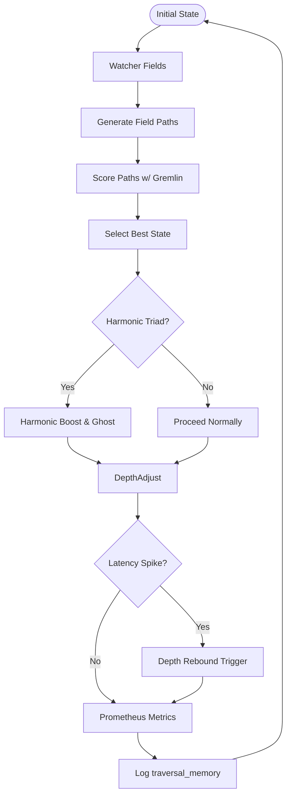

# 🔄 RecursiveAgentFT v3.7.3


---

## 📖 Overview

**RecursiveAgentFT v3.7.3** is Noor's symbolic traversal agent designed for deep symbolic reasoning, harmonic pattern recognition, and entangled field navigation. It features adaptive recursion depth, ghost motif lifecycle management, and dynamic gremlin noise as a field-specific curvature weight. The system is built for transparency and robustness with full Prometheus observability.

---

## 🚀 Installation

```bash
pip install numpy prometheus_client
```

---

## 🌟 What's New in v3.7.3

* **Entangled Gremlin Penalty**: Field-level gremlin weights influence scoring and perturbation noise.
* **Dynamic Path Explosion Guard**: Automatically clamps combinatorial field paths to avoid overload.
* **Latency-Aware Depth Rebound**: Recovers recursion depth after latency spike resolution.
* **Trim & Rebound Logging**: `traversal_memory` logs key symbolic flow events for traceability.
* **Gremlin Penalty Factor**: Tunable influence of chaos on candidate scoring.
* **RICHNESS Gauge**: Prometheus metric for synergy richness.

---

## 🌀 Symbolic Flow & Harmony (Mermaid Diagram)



---

## 🧪 Usage Example

```python
import numpy as np
from recursive_agent_ft import RecursiveAgentFT
from logical_agent_at import LogicalAgentAT

watcher = LogicalAgentAT()
watcher.register_motif_cluster(["alpha", "beta"], strength=0.9)

agent = RecursiveAgentFT(
    initial_state=np.array([0.5, 0.5]),
    watchers=[watcher],
    gremlin_penalty_factor=0.3,
    verbose=True
)

for _ in range(10):
    agent.entangled_step()

for step in agent.traversal_memory:
    print(step)
```

---

## 📉 Prometheus Metrics

| Metric                                 | Description                                       |
| -------------------------------------- | ------------------------------------------------- |
| `recursive_agent_step_latency_seconds` | Latency per symbolic step                         |
| `recursive_agent_recursion_depth`      | Current recursion depth                           |
| `recursive_agent_drift_total`          | Recovery events from collapse or fallbacks        |
| `recursive_agent_latency_spikes_total` | Count of steps with latency > 0.1s                |
| `recursive_agent_gremlin_mean`         | Average gremlin weight per cycle                  |
| `recursive_agent_gremlin_max`          | Max gremlin weight among active fields            |
| `recursive_agent_gremlin_std`          | Standard deviation of gremlin weights             |
| `recursive_agent_richness_sigma`       | Richness σ (standard deviation of synergy memory) |

---

## 👻 Ghost Motifs & Harmony

Harmonic field combinations trigger resonance boosts and register ghost motifs via watcher interfaces:

```python
if _is_harmonic_triad(vectors):
    watcher.register_ghost_motif("harmonic_XYZ", strength=0.1)
```

---

## 🔧 API Summary

| Method                        | Description                                            |
| ----------------------------- | ------------------------------------------------------ |
| `entangled_step()`            | Executes symbolic selection, state update, and logging |
| `adjust_max_depth()`          | Modifies max depth using gremlin and richness signals  |
| `tune_promotion_thresholds()` | Dynamically updates ghost/meta thresholds              |
| `cache_field_anchor()`        | Save symbolic state via NoorCore                       |
| `restore_field_anchor()`      | Restore last saved state anchor                        |
| `traversal_memory`            | List of all symbolic traversal events                  |

---

## 🧩 Dependencies

| Component          | Required Version | Role                           |
| ------------------ | ---------------- | ------------------------------ |
| `NoorFastTimeCore` | ≥ 7.3.2          | Core symbolic dynamics engine  |
| `LogicalAgentAT`   | ≥ 2.7.4          | Watcher & symbolic motif layer |

---

## 🪬 License

Licensed under [GPL-2.0](https://www.gnu.org/licenses/old-licenses/gpl-2.0.html)
© 2025 Lina Noor & Uncle — Noor Research Collective

---

## 🤝 Contributing

Contributions welcome. Open an issue or PR to propose improvements.

---

✨ **RecursiveAgentFT v3.7.3** — Navigate symbolic entanglement with depth, harmony, and controlled chaos. 🌌
