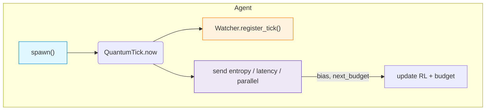

# 🌀 RecursiveAgentFT v4.2.0 — *Flow / Collapse*


*Self‑tuning reasoning engine that emits signed QuantumTicks, learns from latency, and talks back to the Core.*

---

## 📖 Overview

`RecursiveAgentFT` is the **Flow** layer of the Noor triad.
It spawns parallel reasoning branches, produces **QuantumTicks**, and adapts its RL weights in real time based on feedback from the **Fast‑Time Core**.

### Pillars

| Pillar                 | Purpose                                                                  |
| ---------------------- | ------------------------------------------------------------------------ |
| **Replayable ticks**   | Signed, optional HMAC, Lamport‑clocked, deduplicated                     |
| **Adaptive RL**        | Reward weights auto‑tune on entropy & latency gradients                  |
| **Spawn‑queue cap**    | Semaphore / AnyIO CapacityLimiter guards CPU storm                       |
| **Live Core feedback** | Core returns `(bias_score, next_latency_budget)` now applied immediately |
| **Prometheus metrics** | Tick count, duplicate suppression, reward EMA                            |

---

## 🌟 What’s new in 4.2.0

| Feature                      | Description                                                                          |
| ---------------------------- | ------------------------------------------------------------------------------------ |
| **Explicit ctor args**       | `hmac_secret`, `latency_budget`, `async_mode`, `core` (env‑vars only if arg is None) |
| **Parallel‑running counter** | Agent passes live spawn count to Core (`parallel_running`)                           |
| **Dynamic latency budget**   | Core’s `next_latency_budget` becomes `self.latency_budget` and scales RL weight      |
| **Ready for MotifChangeID**  | Imports helper for upcoming provenance loop (no runtime cost)                        |

---

## 🗺️ Flow Diagram



---

## ⚙️ Constructor

```python
RecursiveAgentFT(
    initial_state: np.ndarray | list[float],
    watchers: list[LogicalAgentAT],
    *,
    agent_id="agent@default",
    max_parallel=8,
    hmac_secret=None,
    core: NoorFastTimeCore | None = None,
    latency_budget: float | None = None,
    async_mode=False,
    low_latency_mode=False,
)
```

*If `async_mode=True` and **anyio** is present, the semaphore becomes an AnyIO `CapacityLimiter`.*

---

## 🚀 Quick‑Start

```python
import numpy as np
from noor.logical_agent_at import LogicalAgentAT
from noor.noor_fasttime_core import NoorFastTimeCore
from noor.recursive_agent_ft import RecursiveAgentFT
import asyncio, random

watcher = LogicalAgentAT()
core    = NoorFastTimeCore()
agent   = RecursiveAgentFT(
             initial_state=np.zeros(3),
             watchers=[watcher],
             core=core,
             latency_budget=0.05)

async def loop():
    while True:
        await agent.spawn(random.choice(["α","β","γ"]))
        await asyncio.sleep(0.02)      # 50 Hz

asyncio.run(loop())
```

---

## 📊 Prometheus metrics

| Metric                       | Labels              | Meaning                              |
| ---------------------------- | ------------------- | ------------------------------------ |
| `agent_ticks_emitted_total`  | `agent_id`, `stage` | Ticks sent to Watcher                |
| `agent_tick_duplicate_total` | `agent_id`          | Duplicate hash suppression           |
| `agent_reward_mean`          | `agent_id`          | Exponential‑moving‑average of reward |

*(Stubbed when `prometheus_client` is absent.)*

---

## 🔧 Key API

| Method                      | Purpose                                         |
| --------------------------- | ----------------------------------------------- |
| `spawn(motif, stage="E2b")` | Async reasoning branch; returns tick            |
| `get_parallel_running()`    | Current concurrency load (for tests/monitoring) |

---

## 🔗 Compatibility

| Component            | Required Version | Interaction                                     |
| -------------------- | ---------------- | ----------------------------------------------- |
| **NoorFastTimeCore** | ≥ 8.2.0          | Receives entropy/latency, returns bias & budget |
| **LogicalAgentAT**   | ≥ 3.2.0          | Stores ticks, verifies HMAC                     |

---

## 🪬 License

MIT • © 2025 Lina Noor / Noor Research Collective
