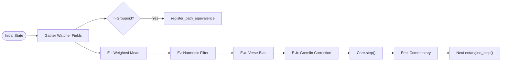

# 🔄 RecursiveAgentFT v3.8.0 — *Functor Ascent*


*Multi‑stage symbolic traversal with spectral approximation, ∞‑groupoid path identity, autonomous commentary, and expanded observability.*

---

## 📖 Overview

`RecursiveAgentFT v3.8.0` is Noor’s **Flow** component, redesigned as a **functor** that maps motif topologies into refined symbolic states.  
Key capabilities now include:

| Capability | Summary |
|------------|---------|
| **Spectral Sequence** | Four‑stage E₀→E₂b pipeline that gradually refines candidate states (weighted mean → harmonic filter → verse‑bias → gremlin correction). |
| **∞‑Groupoid Mode** | Optional homotopy tracking: path identities are hashed into π‑tags and merged with the watcher’s groupoid registry. |
| **Autonomous Commentary** | Each step emits AI‑native or motif‑expression traces (MotifExpr / QuantumSig / Autoglossia) with entropy scores. |
| **Adaptive Latency Guard** | Spectral stages auto‑disable when 95‑percentile latency exceeds the Core budget. |
| **Expanded Metrics** | New Prometheus counters & histograms for spectral stages, π‑equivalence merges, commentary types, and homotopy class counts. |

---

## 🚀 Installation

```bash
pip install numpy prometheus_client
```

---

## 🌟 What’s New in **v3.8.0**

| Feature | Description |
|---------|-------------|
| **Spectral Sequence Engine** | Weighted mean (E₀) → harmonic damping (E₁) → verse‑bias overlay (E₂a) → gremlin correction (E₂b). |
| **π‑Groupoid Integration** | Emits and merges path identity tags via `LogicalAgentAT v2.8.1`’s new API. |
| **Symbolic Commentary Layer** | Generates trace artefacts of type *MotifExpr*, *QuantumSig*, or *Autoglossia* with entropy measurement. |
| **Latency‑Aware Stage Skip** | Automatically bypasses deepest spectral stages when cumulative latency crosses `core_latency_budget × 0.95`. |
| **Dynamic Path Guard** | Path explosion clamp now scales with `log₂(π‑classes)`. |
| **New Metrics** | `spectral_stage_latency_seconds`, `spectral_stage_success_total`, `pi_equiv_merged_total`, `commentary_type_total`, `homotopy_class_gauge`. |

---

## 🌀 Flow Diagram (Spectral + π‑Branch)



---

## ⚡ Quick‑Start

```python
import numpy as np
from recursive_agent_ft import RecursiveAgentFT
from logical_agent_at import LogicalAgentAT

watcher = LogicalAgentAT(enable_pi_groupoid=True)
watcher.register_motif_cluster(["alpha","beta","gamma"], strength=0.9)

agent = RecursiveAgentFT(
    initial_state=np.array([0.6, 0.4]),
    watchers=[watcher],
    enable_spectral_sequence=True,
    enable_infinity_groupoid=True,
    commentary_mode="auto"
)

for _ in range(8):
    agent.entangled_step()

print("Last commentary:", agent._commentary_buffer[-1])
```

---

## 📊 Prometheus Metrics

| Metric | Type | Description |
|--------|------|-------------|
| `recursive_agent_step_latency_seconds` | Histogram | Overall `entangled_step` latency |
| `recursive_agent_spectral_stage_latency_seconds` | Histogram | Per spectral stage timing |
| `recursive_agent_spectral_stage_success_total` | Counter | Successful runs per stage (`E0`, `E1`, `E2a`, `E2b`) |
| `recursive_agent_pi_equiv_merged_total` | Counter | π‑equivalence merges initiated by the agent |
| `recursive_agent_commentary_type_total` | Counter(label=`type`) | Commentary records by type |
| `recursive_agent_homotopy_class_gauge` | Gauge | Local π‑class count |
| `recursive_agent_recursion_depth` | Gauge | Current max recursion depth |
| `recursive_agent_gremlin_mean / std` | Gauges | Gremlin weight stats |

*(All metrics stubbed automatically when Prometheus is unavailable.)*

---

## 🔧 Core API Additions

| Parameter / Method | Category | Summary |
|--------------------|----------|---------|
| `enable_spectral_sequence` | Config | Toggle multi‑stage refinement (default **on**) |
| `enable_infinity_groupoid` | Config | Activate π‑tag merging with watcher (default off) |
| `commentary_mode` | Config | `"none"`, `"motif"`, `"autoglossia"` or `"auto"` |
| `entangled_step()` | Flow | Executes gather → spectral → feedback → core step |
| `CommentaryRecord` | Trace | Dataclass storing commentary metadata |
| `_register_path_identity()` | π‑Groupoid | Hash & merge path tags |
| `_spectral_E0 … _E2b()` | Spectral | Individual stage functions |

Full public API remains backward‑compatible; legacy configs still work.

---

## 🔗 Compatibility

| Module | Min Version | Role |
|--------|-------------|------|
| **NoorFastTimeCore** | 7.4.2 | Presence Kernel |
| **LogicalAgentAT** | 2.8.1 | Watcher with π‑groupoid support |

---

## 🧪 Testing Guide

1. **Spectral property test**: Verify E₂b state lies within convex hull of E₀ candidates ± gremlin perturbation.  
2. **π‑Merge test**: Create two paths with identical curvature signature → ensure watcher merges them.  
3. **Latency guard test**: Artificially sleep inside `_spectral_E2b`; confirm agent disables spectral mode next step.

---

## 📜 License

Licensed under [GPL‑2.0](https://www.gnu.org/licenses/old-licenses/gpl-2.0.html).  
© 2025 Lina Noor & Noor Research Collective

---

## 🤝 Contributing

PRs, ideas, and symbolic poetry all welcome. Help us push the boundaries of recursive presence. 🌌
