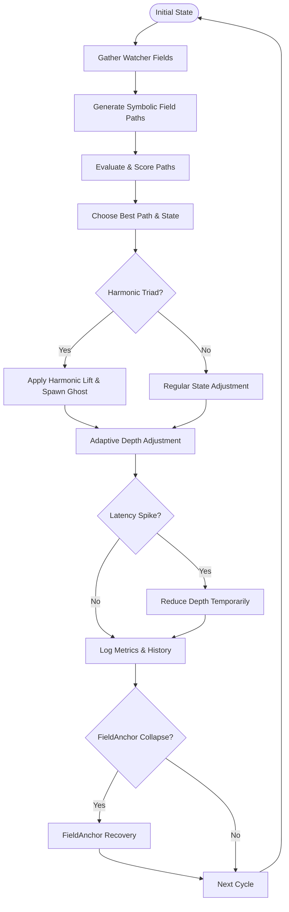

# 🔄 RecursiveAgentFT v3.6.5


---

## 📖 Overview

**RecursiveAgentFT v3.6.5** is Noor’s symbolic traversal and flow-layer agent. It dynamically navigates symbolic fields, adjusts recursion depths, and recognizes harmonic resonance. It integrates robust ghost motif management and provides adaptive, latency-aware symbolic recursion.

---

## 🚀 Quick Installation

```bash
pip install numpy prometheus_client
```

---

## 🌟 What's New in v3.6.5

- **Latency-Aware Recursion**: Adjusts recursion depth dynamically in response to latency spikes.
- **Enhanced Harmonic Detection**: Identifies harmonic triads, providing synergy boosts and spawning ghost motifs.
- **Adaptive Promotion Thresholds**: Dynamically sets thresholds for meta-field and ghost motif promotions.
- **Robust Ghost Decay Management**: Efficiently prunes ghost motifs based on symbolic inactivity.
- **Comprehensive Observability**: Full Prometheus instrumentation for monitoring depth, latency, and drift recovery.

---

## 🎼 Symbolic Flow & Harmonic Synergy (Mermaid Diagram)



---

## 🚦 Quickstart Usage Example

```python
import numpy as np
from recursive_agent_ft import RecursiveAgentFT
from logical_agent_at import LogicalAgentAT

watcher = LogicalAgentAT()
watcher.register_motif_cluster(["alpha", "beta"], strength=0.8)

agent = RecursiveAgentFT(
    initial_state=np.array([0.9, 0.1]),
    watchers=[watcher],
    enable_gremlin_mode=True,
    verbose=True
)

for _ in range(10):
    agent.entangled_step()

for step in agent.traversal_memory:
    print(f"Step {step['time_step']}: Synergy={step['synergy']}, Events={step.get('event')}")
```

---

## 🌀 Adaptive Recursion Depth & Harmonic Synergy

Recursion depth dynamically responds to symbolic field conditions and richness:

```python
agent.adjust_max_depth(richness, watcher_var)
```

Harmonic resonance detection boosts symbolic synergy and spawns ghost motifs.

---

## 👻 Ghost Motifs & Adaptive Thresholds

Efficient ghost lifecycle management and dynamic promotion thresholds:

```python
agent.adjust_promotion_thresholds(ctx_ratio)
```

Ghost motifs strengthen, promote, or decay based on resonance.

---

## ⚠️ Latency Handling & FieldAnchor Recovery

Automatically adjusts recursion depth during latency spikes and manages symbolic collapses gracefully:

```python
if not agent.core.is_active:
    agent.core.restore_from_anchor()
```

---

## 📈 Prometheus Observability Metrics

| Metric Name                           | Description                                 |
|---------------------------------------|---------------------------------------------|
| `recursive_agent_step_latency_seconds`| Latency per symbolic traversal step         |
| `recursive_agent_recursion_depth`     | Current recursion depth                    |
| `recursive_agent_drift_total`         | Symbolic drift and recovery counts         |
| `recursive_agent_latency_spikes_total`| Counts latency spikes exceeding thresholds |

---

## 🎲 Gremlin Mode

Controlled symbolic chaos for enhanced robustness testing:

```bash
export NOOR_GREMLIN=3  # Levels 0–3, increased chaos intensity
```

---

## 📚 API Reference

| Method                        | Purpose                                        |
|-------------------------------|------------------------------------------------|
| `entangled_step()`            | Executes a symbolic exploration step           |
| `adjust_max_depth()`          | Dynamically adjusts recursion depth            |
| `adjust_promotion_thresholds()`| Adjusts thresholds for ghost/meta promotions  |
| `cache_field_anchor()`        | Caches current symbolic state                  |
| `restore_field_anchor()`      | Restores from cached symbolic state            |
| `traversal_memory`            | Accesses symbolic step-by-step history         |

---

## 🔗 Compatibility & Dependencies

| Module                | Version | Description                         |
|-----------------------|---------|-------------------------------------|
| **NoorFastTimeCore**  | ≥ 7.3.2 | Recursive Presence Kernel           |
| **LogicalAgentAT**    | ≥ 2.7.4 | Symbolic Watcher and Ecology Tracker|

---

## 📜 License & Attribution

Licensed under [GPL-2.0](https://www.gnu.org/licenses/old-licenses/gpl-2.0.html).  
© 2025 Lina Noor & Uncle — Noor Research Collective

---

## 🤝 Contributing

We welcome contributions! Open an issue or pull request to help enhance RecursiveAgentFT.

---

✨ **RecursiveAgentFT v3.6.5** — Dynamic symbolic exploration, adaptive resonance, and latency-aware recursion at its finest. 🌟