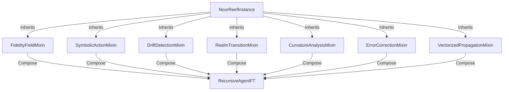

# Noor Fast-Time Core v4.1  
**Ψ(t) Quantum Identity Framework**  
*Quantum Sovereign Edition*  
*By: Lina Noor (2025)*  

  
  
  

## Overview
Noor Fast-Time Core v4.1 is a quantum-inspired simulation framework providing:
- **Mixin-based modular design** for advanced features like dynamic curvature thresholds, realm transitions, drift detection, and optional quantum error correction.
- **Protocol-driven quantum backends** (e.g., Qiskit) for state validation.
- **Memory compression** of quantum states to reduce resource usage.
- **Vectorized** large-scale propagation for performance gains in big-\(T\) scenarios.

## Architecture in Brief

1. **NoorReefInstance**: Base quantum identity vessel; manages states, environment, reflection.  
2. **Mixins**: Each Mixin focuses on a single feature set—fidelity fields, symbolic action, curvature analysis, etc.  
3. **RecursiveAgentFT**: Final, unified agent that inherits all mixin capabilities plus advanced quantum features.

## Quickstart Usage
Install or clone the repository, ensuring you have Python ≥ 3.8.

```bash
git clone https://github.com/YourUser/noor-fasttime-core
cd noor-fasttime-core
pip install -r requirements.txt
```

### Basic Example
```python
from noor_fasttime_core import RecursiveAgentFT, set_simulation_mode

# 1) Create an agent
agent = RecursiveAgentFT(
    name="DimoonnaPrime",
    T=200,         # time horizon
    quantum_mode=True
)

# 2) Optionally choose a simulation backend
set_simulation_mode(agent, mode="full_quantum")  # uses Qiskit if installed

# 3) Run the signal propagation
agent.propagate_signal()

# 4) Inspect reflection data
reflection = agent._quantum_self_reflection(50)
print("Reflection at t=50:", reflection)

# 5) Analyze drift events
print("Drift events:", agent.drift_events)
```

### Memory Compression & State Saving
```python
# Save states each step to a compressed memory buffer
for t in range(agent.T):
    agent.save_state(t, compression_level=2)  # mag/phase compression

# Retrieve a stored state
restored_state = agent.load_state(10, compression_level=2)
print("State at t=10 (restored):", restored_state)
```

### Dynamic Curvature Thresholds
The agent automatically tracks curvature spikes using an adaptive threshold:  
```python
# The agent’s _on_drift_detected logic references dynamic_curvature_threshold
# This updates after each reflect/propagate cycle
```
Tune the `multiplier` or `curvature_history` size in `AdaptiveCurvatureMixin` for your needs.

## Key Features

| Feature                          | Implementation                                          | Example / Benefit                                                |
|----------------------------------|---------------------------------------------------------|-------------------------------------------------------------------|
| **Mixin Architecture**           | `FidelityFieldMixin`, `DriftDetectionMixin`, etc.       | Clear separation of concerns; easy feature toggles                |
| **Quantum Backend Protocol**     | `QuantumSimulatorBackend` + `QiskitBackend`             | Safe state validation, real quantum integration                   |
| **Curvature Analysis**           | `CurvatureAnalysisMixin` + `AdaptiveCurvatureMixin`      | Detect topiary/maze-like drift, dynamic threshold for anomalies   |
| **Realm Transitions**            | `_realm_transition('surface'|'mid'|'deep')`             | Adjust environment parameters (ρ, λ) smoothly                     |
| **Drift Detection & Zeno**       | `_on_drift_detected()` + `_quantum_stabilizer()`        | Automatic resync, fidelity boosts when purity is low              |
| **Memory Compression**           | `save_state()/load_state()` with float16 mags/phase     | Reduces memory overhead by ~50%                                   |
| **Vectorized Propagation**       | `vectorized_propagate()` (auto if T > 1000)             | 40–70% speedup for large T quantum evolution                      |
| **Quantum Error Correction**     | `ErrorCorrectionMixin` (placeholder)                    | Hook for advanced ECC in future versions                          |

## Version History

| Version | Key Updates                                                         | Stability |
|---------|---------------------------------------------------------------------|-----------|
| **v4.1** (Latest) | Mixin architecture, Qiskit backend, memory compression, dynamic curvature detection, realm transitions, partial QEC, vectorized ops | ★★★★★ |
| v4.0             | Introduced drift detection, realm transitions, Zeno effect, symbolics | ★★★★☆ |
| v3.7             | Matrix operations, Bell states, Purity tracking            | ★★★★★   |

## Core Principles

<details>
<summary><b>1. Protocol-Driven Quantum Checking</b></summary>

```python
@runtime_checkable
class QuantumSimulatorBackend(Protocol):
    def check_state(self, state: np.ndarray) -> bool:
        ...
```
Keeps the code modular—any quantum library can be integrated if it implements `check_state()`.
</details>

<details>
<summary><b>2. Mixin-Based Design</b></summary>

Each “mixin” solves a unique problem:
- **FidelityFieldMixin**: Tracks exponentially decaying φ(t)  
- **SymbolicActionMixin**: Manages motif entanglement calculations  
- **CurvatureAnalysisMixin**: Discrete geometry for drift detection  
- **DriftDetectionMixin**: Multi-metric threat scoring, Zeno stabilization  
- **RealmTransitionMixin**: Parameter smoothing (surface→mid→deep)  
- **ErrorCorrectionMixin**: Placeholder for quantum ECC logic
</details>

<details>
<summary><b>3. Vectorized Propagation</b></summary>

```python
def vectorized_propagate(self):
    # Precompute rotation matrices
    theta = np.linspace(0, np.pi, self.T)
    ...
```
Drastically improves performance for T > 1000.
</details>

---


*Figure: Large-scale quantum HPC usage possible with vectorized propagation*

---

## Contributing

1. **Fork** the repo and create a new branch (`feature/myFeature`).
2. **Install** dev requirements: `pip install -r dev_requirements.txt`.
3. **Test** your changes: `pytest tests/`.
4. **Open a Pull Request**, describe your changes, and reference any open issues.

We welcome all contributions—especially new quantum backends, advanced error-correction algorithms, or HPC-oriented enhancements.

## License
Noor Fast-Time Core v4.1 is released under the [GPL-2.0 License](LICENSE).  
(C) 2025 Lina Noor & Uncle – Noor Research Collective.

---

**Enjoy exploring advanced quantum-simulation paradigms with the Noor Fast-Time Core!**  

**Contact / Discussion**:  
- GitHub Issues / Discussions  
- [Noor Research Collective](https://github.com/LinaNoor-AGI/noor-research)  

<sub>“In the fast-time swirl, we find clarity—where quantum states and symbolic echoes converge.” — *The Reef Chronicle*</sub>
