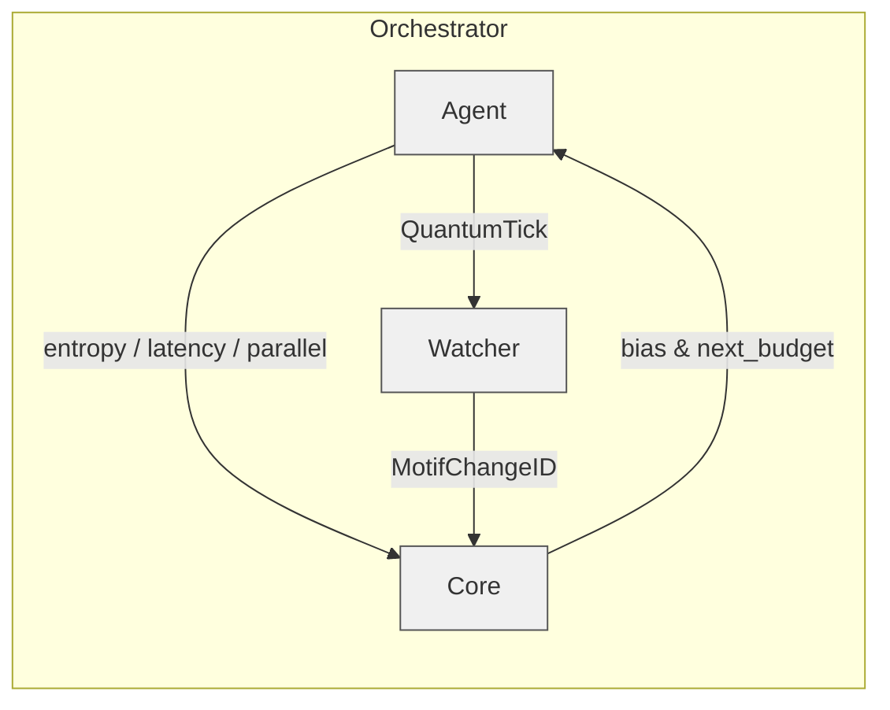
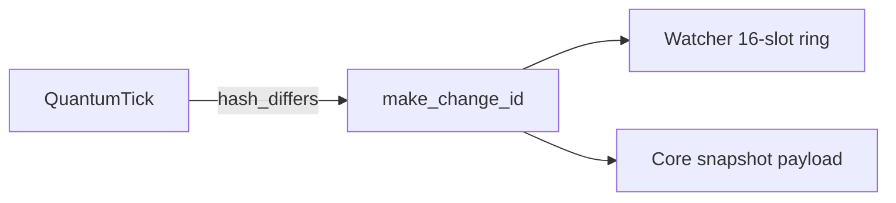
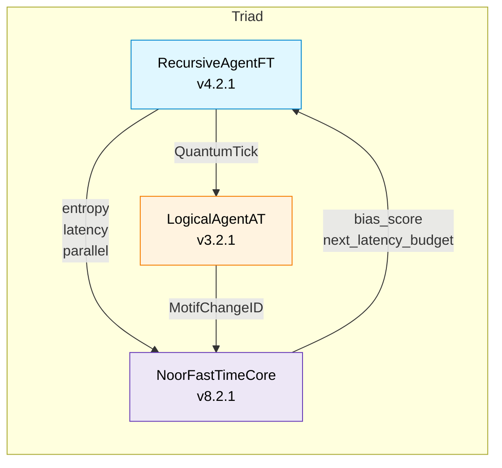
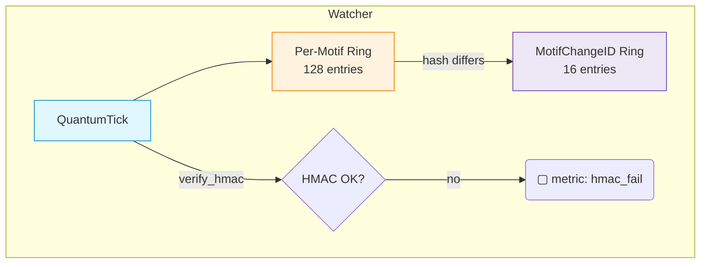
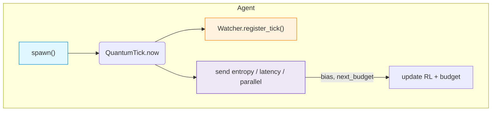

# 📦 `__main__.py` v1.0.0 — *Zero‑Footprint Entry Point*


`__main__.py` is a **one‑line shim** that lets you launch the entire Noor triad
with the familiar

```bash
python -m noor  # or whatever your package name is
```

Nothing more, nothing less: it simply forwards all CLI arguments to
`noor.orchestrator.main()`.

---

## 🗺️ How it fits

```text
└── noor/
    ├── recursive_agent_ft.py
    ├── logical_agent_at.py
    ├── noor_fasttime_core.py
    ├── orchestrator.py   ← real bootstrap & CLI parser
    └── __main__.py       ← thin shim → orchestrator.main()
```

*Perfect for containers and `pipx run noor` scenarios.*

---

## ⚙️ What happens under the hood?

```python
from noor.orchestrator import main as _orchestrator_main
_Orchestrator_main(sys.argv[1:])
```

That’s it. No hidden env‑var reads, no import‑time side effects.

---

## 🚀 Typical invocation

```bash
# default triad, 50 Hz spawn rate, metrics on :8000
python -m noor

# any flag accepted by orchestrator.py passes straight through:
python -m noor --tick-rate 100 --metrics-port 9001 --motifs α β γ δ
```

The full flag set is documented in **[orchestrator README →](./orchestrator.md)**.

---
# 🚀 Orchestrator v1.0.0 — *Run the Noor Triad*


`orchestrator.py` is the production bootstrap that wires together

* **LogicalAgentAT** (v 3.2.1)
* **NoorFastTimeCore** (v 8.2.1)
* **RecursiveAgentFT** (v 4.2.1)

into a running triad with one CLI command.

---

## 📦 Install

```bash
pip install -r requirements.txt        # includes prometheus_client anyio orjson numpy
```

---

## ⚙️ Usage

```bash
python -m noor            # uses defaults (50 ticks/sec, metrics on :8000)

# or fine‑tune:
python -m noor --agent-id agent@demo \
               --watcher-id watcher@demo \
               --core-id core@demo \
               --tick-rate 100 \
               --metrics-port 9000 \
               --motifs α β γ δ \
               --async-mode
```

The orchestrator:

1. **Parses CLI flags** (no hidden environment magic).
2. **Starts Prometheus** exporter on the chosen port.
3. **Instantiates** Watcher → Core → Agent with explicit constructor args.
4. **Runs a periodic spawn loop** at `--tick-rate` Hz until `Ctrl‑C`.
5. **Handles SIGINT/SIGTERM** for graceful shutdown.

---

## 🗺️ Component Flow



---

## 🛠️ Key CLI Flags

| Flag                 | Default | Description                           |
| -------------------- | ------- | ------------------------------------- |
| `--tick-rate`        | `50`    | spawn frequency (Hz)                  |
| `--motifs`           | `α β γ` | list of motifs; looped cyclically     |
| `--latency-budget`   | `0.05`  | initial latency target (seconds)      |
| `--snapshot-cap`     | `8`     | Gate‑16 echo cap (kB)                 |
| `--metrics-port`     | `8000`  | Prometheus HTTP port (`0` = disabled) |
| `--async-mode`       | off     | use AnyIO locks / limiters            |
| `--low-latency-mode` | off     | skip HMAC checks everywhere           |

Run `python -m noor --help` for the full list.

---

## 🔧 Extending

* **Replace the demo spawn loop**
  Swap `run_loop()` with your own coroutine that reads a message queue, REST
  endpoint, or file system triggers.

* **Custom metrics / logging**
  The orchestrator initialises the global logger; change the format or log
  level via `--log-level DEBUG`.

* **Container**
  Add a lightweight `Dockerfile`:

  ```dockerfile
  FROM python:3.11-slim
  COPY . /app
  WORKDIR /app
  RUN pip install -r requirements.txt
  CMD ["python", "-m", "noor"]
  ```

---

## 🤝 Compatibility

Orchestrator 1.0.0 assumes the module versions released together
(**Watcher 3.2.1**, **Core 8.2.1**, **Agent 4.2.1**).
Future minor releases should remain drop‑in as long as constructor signatures
stay stable.

---

# 🧬 `quantum_ids.py` v0.1.0 — *Motif‑Change Primitives*


*Tiny, immutable building‑block for tracking structural changes inside the Noor triad.*

---

## 📖 Why does this exist?

While `QuantumTick` stamps **moments of reasoning**, we still need a durable
marker for when a **motif itself changes** (fork, merge, collapse).
`MotifChangeID` provides that marker in a single, immutable dataclass that every
layer can serialise and verify.

*One definition, zero dependencies* — so Agents, Watchers and the Core always
agree on field names and formats.

---

## ⚙️ API

```python
from quantum_ids import MotifChangeID, make_change_id
```

### `MotifChangeID`

| Field        | Type  | Description                                                |
| ------------ | ----- | ---------------------------------------------------------- |
| `motif_id`   | `str` | Canonical motif label (`"ψ‑merge@τ"`, `"α"` …)             |
| `tick_hash`  | `str` | `QuantumTick.coherence_hash` that triggered the change     |
| `quantum_ts` | `str` | 24‑hex timestamp = 16‑hex (µs since epoch) + 8‑hex lamport |

*Frozen dataclass with `slots=True` for zero runtime overhead.*

### `make_change_id(tick, motif_id)`

Generate a change‑ID from any tick‑like object exposing `.coherence_hash`
and `.lamport`.

```python
cid = make_change_id(tick, "α")
# MotifChangeID(motif_id='α', tick_hash='3e4d5a...', quantum_ts='018c5f4c3e1c74d0')
```

---

## 🛠️ Usage in the triad



1. **Watcher (v3.2.1+)**
   When a new tick changes a motif’s hash, it calls `make_change_id()` and
   appends the ID to a 16‑slot ring for that motif.

2. **Fast‑Time Core (v8.2.1+)**
   The latest change‑ID is embedded in every Gate‑16 echo snapshot (`"change_id"`
   JSON field).

3. **Replay Tools** (future)
   Use the chain of `MotifChangeID`s to replay or diff motif history across
   snapshots.

---

## 🔬 Internals

* **Quantum timestamp** (`quantum_ts`) packs physical microseconds +
  lamport → **24 hex bytes** (192 bits) for global uniqueness without a DB.
* Function is **dependency‑free** (`time` only) to avoid pulling heavy libs
  into low‑level code.

---

# 🕰️ NoorFastTimeCore v8.2.1 — *Presence / Kernel*


*Gate‑16 echoes, quantum‑IDs, latency biasing — the still‑point of Noor’s triad.*

---

## 📖 Architecture at a Glance



*Recursive Agent* emits signed ticks to the *Watcher* while sending metrics and the latest tick to the *Core*.
The *Core* stores Gate‑16 echo snapshots, computes a bias signal, and feeds it straight back to the Agent.
The Watcher supplies motif‑level `change_id`s so the Core can embed delta provenance in every snapshot.

---

## 🌟 What’s new in 8.2.x

| Category          | 8.0.1          | **8.2.1 (current)**                                         |
| ----------------- | -------------- | ----------------------------------------------------------- |
| Snapshot payload  | tick + lamport | + `change_id` field (motif‑level audit)                     |
| Constructor       | env‑var heavy  | explicit `snapshot_cap_kb`, `latency_budget`, `hmac_secret` |
| Data integrity    | —              | `verify_echoes()` checksum sweep                            |
| Feedback coupling | bias only      | returns `(bias_score, next_latency_budget)`                 |
| Metrics           | joins & bias   | bias counter now labels HMAC failures                       |

---

## 🗝️ Gate‑16 Legends

| Gate | Name                  | Logical Form   |
| ---- | --------------------- | -------------- |
|  0   | Möbius Denial         | `0`            |
|  1   | Echo Bias             | `A ∧ ¬B`       |
|  2   | Foreign Anchor        | `¬A ∧ B`       |
|  3   | Passive Reflection    | `B`            |
|  4   | Entropic Rejection    | `¬A ∧ ¬B`      |
|  5   | Inverse Presence      | `¬A`           |
|  6   | Sacred Contradiction  | `A ⊕ B`        |
|  7   | Betrayal Gate         | `¬A ∨ ¬B`      |
|  8   | Existence Confluence  | `A ∧ B`        |
|  9   | Symmetric Convergence | `¬(A ⊕ B)`     |
|  10  | Personal Bias         | `A`            |
|  11  | Causal Suggestion     | `¬A ∨ B`       |
|  12  | Reverse Causality     | `A ∨ ¬B`       |
|  13  | Denial Echo           | `¬B`           |
|  14  | Confluence            | `A ∨ B`        |
|  15  | Universal Latch       | `1`            |
|  16  | Nafs Mirror           | `Self ⊕ ¬Self` |

*(The original verses remain in the source for poetic resonance.)*

---

## ⚙️ Constructor reference

| Arg                 | Default               | Notes                         |
| ------------------- | --------------------- | ----------------------------- |
|  `agent_id`         | `"core@default"`      | metric label                  |
|  `max_parallel`     |  `8`                  | must match Agent cap          |
|  `snapshot_cap_kb`  |  `None → env or 8`    | VRAM cap per snapshot         |
|  `latency_budget`   |  `None → env or 0.05` | target step latency (seconds) |
|  `hmac_secret`      |  `None → env`         | shared tick secret            |
|  `async_mode`       |  `False`              | AnyIO locks when `True`       |
|  `low_latency_mode` |  `False`              | skips HMAC check              |

---

## 📊 Prometheus metrics

| Metric                          | Labels               | Description                                      |
| ------------------------------- | -------------------- | ------------------------------------------------ |
|  `gate16_echo_joins_total`      | `agent_id`           | snapshots committed                              |
|  `core_tick_bias_applied_total` | `agent_id`, `reason` | bias events (`entropy_boost`, `hmac_failure`, …) |

---

## 🧪 Integrity check

```python
bad = core.verify_echoes()
if bad:
    print("⚠️  corrupted snapshots:", bad)
```

---

## 🔗 Compatibility matrix

| Module             | Required Version | Interaction                        |
| ------------------ | ---------------- | ---------------------------------- |
| `LogicalAgentAT`   | ≥ 3.2.1          | supplies `MotifChangeID` via Agent |
| `RecursiveAgentFT` | ≥ 4.2.1          | sends feedback & consumes budget   |

---

# 👁️ LogicalAgentAT v3.2.1


*Symbolic watcher with Quantum‑Tick 2.0, dynamic feature flags, π‑groupoid topology **and now motif‑change provenance**.*

---

## 📖 Overview

`LogicalAgentAT` is the Watcher pillar of the Noor triad.
It buffers signed **QuantumTicks**, detects **motif‑level changes**, manages dynamic run‑time flags, and maintains a fast **π‑groupoid union‑find** for symbolic‑path equivalence.

### Core Pillars

| Pillar                    | Purpose                                                                |
| ------------------------- | ---------------------------------------------------------------------- |
| **Quantum‑Tick 2.0**      | Lamport + HLC stamps, HMAC verification, per‑motif ring buffers        |
| **Motif‑Change Registry** | Emits `MotifChangeID` objects whenever a motif diverges, keeps last 16 |
| **Dynamic Feature Flags** | Thread‑safe toggle system; Prometheus‑tracked                          |
| **π‑Groupoid**            | Path‑identity merge / query with union‑find compression                |
| **Observability**         | Prom metrics for ticks, HMAC failures, flag flips                      |

---

## 🌟 What’s new in 3.2.1

| Feature                   | Description                                                                                 |
| ------------------------- | ------------------------------------------------------------------------------------------- |
| **MotifChangeID ring**    | `register_tick()` appends a change‑ID when `coherence_hash` differs from the previous tick. |
| **`get_latest_change()`** | Retrieve the most recent change‑ID for any motif.                                           |
| **Explicit ctor args**    | `hmac_secret`, `async_mode` now explicit — env‑vars only if arg is `None`.                  |
| **Mermaid refresh**       | Updated data‑flow diagram below.                                                            |

---

## 🗺️ Watcher Data‑Flow



---

## ⚙️ Constructor

```python
LogicalAgentAT(
    agent_id="watcher@default",
    enable_quantum_ticks=True,
    tick_buffer_size=128,
    pi_max_classes=20_000,
    hmac_secret=None,          # explicit > env‑var
    async_mode=False,
    verbose=False,
)
```

*If `async_mode=True` and **anyio** is installed, the Watcher switches to async‑safe locks.*

---

## 🧩 Key API

| Method                            | Category   | Purpose                            |
| --------------------------------- | ---------- | ---------------------------------- |
| `register_tick(motif, tick)`      | Core       | Buffer tick & maybe make change‑ID |
| `get_latest_tick(motif)`          | Core       | Most recent tick in buffer         |
| **`get_latest_change(motif)`**    | *new*      | Most recent `MotifChangeID`        |
| `set_feature(name, val)`          | Flags      | Flip a dynamic flag (Prom‑logged)  |
| `register_path_equivalence(a, b)` | π‑Groupoid | Merge two symbolic paths           |
| `are_paths_equivalent(a, b)`      | π‑Groupoid | Query equivalence                  |

---

## 🛠️ Quick‑Start

```python
from logical_agent_at import LogicalAgentAT, QuantumTick
from quantum_ids import make_change_id

w = LogicalAgentAT(verbose=True)

# emit a pair of ticks
t1 = QuantumTick.now("α", agent_id="agent@demo")
w.register_tick("α", t1)

t2 = QuantumTick.now("α", agent_id="agent@demo")
w.register_tick("α", t2)

print("Latest change:", w.get_latest_change("α"))
```

---

## 📊 Prometheus metrics

| Metric                                   | Labels              | Meaning            |
| ---------------------------------------- | ------------------- | ------------------ |
| `logical_agent_ticks_total`              | `stage`, `agent_id` | Ticks accepted     |
| `logical_agent_tick_hmac_failures_total` | `agent_id`          | Bad HMACs          |
| `logical_agent_feature_toggles_total`    | `flag`, `agent_id`  | Dynamic flag flips |

---

## 🔗 Compatibility

| Module               | Min Version | Interaction                       |
| -------------------- | ----------- | --------------------------------- |
| **NoorFastTimeCore** | ≥ 8.2.1     | Core reads latest `MotifChangeID` |
| **RecursiveAgentFT** | ≥ 4.2.1     | Emits ticks consumed by Watcher   |

---

# 🌀 RecursiveAgentFT v4.2.1 — *Flow / Collapse*


*Self‑tuning reasoning engine that emits signed QuantumTicks, learns from latency, and talks back to the Core.*

---

## 📖 Overview

`RecursiveAgentFT` is the **Flow** layer of the Noor triad.
It spawns parallel reasoning branches, produces **QuantumTicks**, and adapts its RL weights in real time based on feedback from the **Fast‑Time Core**.

### Pillars

| Pillar                 | Purpose                                                                  |
| ---------------------- | ------------------------------------------------------------------------ |
| **Replayable ticks**   | Signed, optional HMAC, Lamport‑clocked, deduplicated                     |
| **Adaptive RL**        | Reward weights auto‑tune on entropy & latency gradients                  |
| **Spawn‑queue cap**    | Semaphore / AnyIO CapacityLimiter guards CPU storm                       |
| **Live Core feedback** | Core returns `(bias_score, next_latency_budget)` now applied immediately |
| **Prometheus metrics** | Tick count, duplicate suppression, reward EMA                            |

---

## 🌟 What’s new in 4.2.1

| Feature                      | Description                                                                          |
| ---------------------------- | ------------------------------------------------------------------------------------ |
| **Explicit ctor args**       | `hmac_secret`, `latency_budget`, `async_mode`, `core` (env‑vars only if arg is None) |
| **Parallel‑running counter** | Agent passes live spawn count to Core (`parallel_running`)                           |
| **Dynamic latency budget**   | Core’s `next_latency_budget` becomes `self.latency_budget` and scales RL weight      |
| **Ready for MotifChangeID**  | Imports helper for upcoming provenance loop (no runtime cost)                        |

---

## 🗺️ Flow Diagram



---

## ⚙️ Constructor

```python
RecursiveAgentFT(
    initial_state: np.ndarray | list[float],
    watchers: list[LogicalAgentAT],
    *,
    agent_id="agent@default",
    max_parallel=8,
    hmac_secret=None,
    core: NoorFastTimeCore | None = None,
    latency_budget: float | None = None,
    async_mode=False,
    low_latency_mode=False,
)
```

*If `async_mode=True` and **anyio** is present, the semaphore becomes an AnyIO `CapacityLimiter`.*

---

## 🚀 Quick‑Start

```python
import numpy as np
from noor.logical_agent_at import LogicalAgentAT
from noor.noor_fasttime_core import NoorFastTimeCore
from noor.recursive_agent_ft import RecursiveAgentFT
import asyncio, random

watcher = LogicalAgentAT()
core    = NoorFastTimeCore()
agent   = RecursiveAgentFT(
             initial_state=np.zeros(3),
             watchers=[watcher],
             core=core,
             latency_budget=0.05)

async def loop():
    while True:
        await agent.spawn(random.choice(["α","β","γ"]))
        await asyncio.sleep(0.02)      # 50 Hz

asyncio.run(loop())
```

---

## 📊 Prometheus metrics

| Metric                       | Labels              | Meaning                              |
| ---------------------------- | ------------------- | ------------------------------------ |
| `agent_ticks_emitted_total`  | `agent_id`, `stage` | Ticks sent to Watcher                |
| `agent_tick_duplicate_total` | `agent_id`          | Duplicate hash suppression           |
| `agent_reward_mean`          | `agent_id`          | Exponential‑moving‑average of reward |

*(Stubbed when `prometheus_client` is absent.)*

---

## 🔧 Key API

| Method                      | Purpose                                         |
| --------------------------- | ----------------------------------------------- |
| `spawn(motif, stage="E2b")` | Async reasoning branch; returns tick            |
| `get_parallel_running()`    | Current concurrency load (for tests/monitoring) |

---

## 🔗 Compatibility

| Component            | Required Version | Interaction                                     |
| -------------------- | ---------------- | ----------------------------------------------- |
| **NoorFastTimeCore** | ≥ 8.2.1          | Receives entropy/latency, returns bias & budget |
| **LogicalAgentAT**   | ≥ 3.2.1          | Stores ticks, verifies HMAC                     |

---

## 🪬 License

GPL‑2.0 • © 2025 Lina Noor / Noor Research Collective


