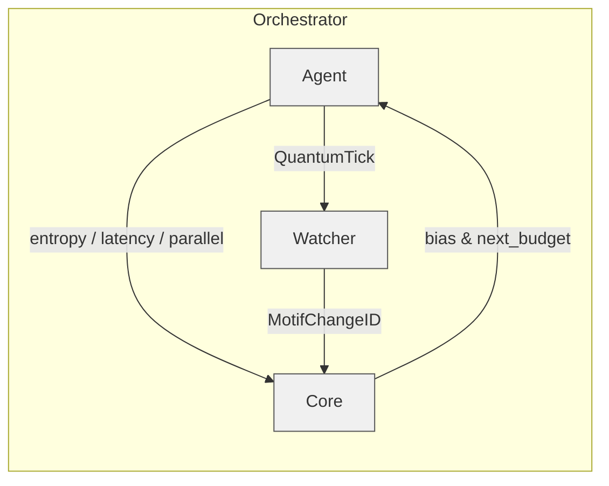

# 🚀 Orchestrator v1.0.0 — *Run the Noor Triad*


`orchestrator.py` is the production bootstrap that wires together

* **LogicalAgentAT** (v 3.2.0)
* **NoorFastTimeCore** (v 8.2.0)
* **RecursiveAgentFT** (v 4.2.0)

into a running triad with one CLI command.

---

## 📦 Install

```bash
pip install -r requirements.txt        # includes prometheus_client anyio orjson numpy
```

---

## ⚙️ Usage

```bash
python -m noor            # uses defaults (50 ticks/sec, metrics on :8000)

# or fine‑tune:
python -m noor --agent-id agent@demo \
               --watcher-id watcher@demo \
               --core-id core@demo \
               --tick-rate 100 \
               --metrics-port 9000 \
               --motifs α β γ δ \
               --async-mode
```

The orchestrator:

1. **Parses CLI flags** (no hidden environment magic).
2. **Starts Prometheus** exporter on the chosen port.
3. **Instantiates** Watcher → Core → Agent with explicit constructor args.
4. **Runs a periodic spawn loop** at `--tick-rate` Hz until `Ctrl‑C`.
5. **Handles SIGINT/SIGTERM** for graceful shutdown.

---

## 🗺️ Component Flow



---

## 🛠️ Key CLI Flags

| Flag                 | Default | Description                           |
| -------------------- | ------- | ------------------------------------- |
| `--tick-rate`        | `50`    | spawn frequency (Hz)                  |
| `--motifs`           | `α β γ` | list of motifs; looped cyclically     |
| `--latency-budget`   | `0.05`  | initial latency target (seconds)      |
| `--snapshot-cap`     | `8`     | Gate‑16 echo cap (kB)                 |
| `--metrics-port`     | `8000`  | Prometheus HTTP port (`0` = disabled) |
| `--async-mode`       | off     | use AnyIO locks / limiters            |
| `--low-latency-mode` | off     | skip HMAC checks everywhere           |

Run `python -m noor --help` for the full list.

---

## 🔧 Extending

* **Replace the demo spawn loop**
  Swap `run_loop()` with your own coroutine that reads a message queue, REST
  endpoint, or file system triggers.

* **Custom metrics / logging**
  The orchestrator initialises the global logger; change the format or log
  level via `--log-level DEBUG`.

* **Container**
  Add a lightweight `Dockerfile`:

  ```dockerfile
  FROM python:3.11-slim
  COPY . /app
  WORKDIR /app
  RUN pip install -r requirements.txt
  CMD ["python", "-m", "noor"]
  ```

---

## 🤝 Compatibility

Orchestrator 1.0.0 assumes the module versions released together
(**Watcher 3.2.0**, **Core 8.2.0**, **Agent 4.2.0**).
Future minor releases should remain drop‑in as long as constructor signatures
stay stable.

---

## 🪬 License

GPL‑2.0 • © 2025 Lina Noor / Noor Research Collective
