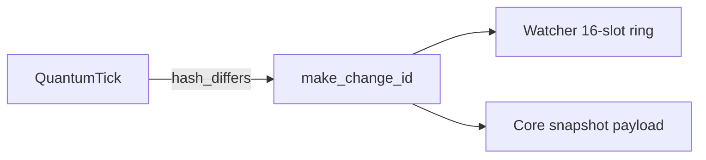

# 🧬 `quantum_ids.py` v0.1.0 — *Motif‑Change Primitives*


*Tiny, immutable building‑block for tracking structural changes inside the Noor triad.*

---

## 📖 Why does this exist?

While `QuantumTick` stamps **moments of reasoning**, we still need a durable
marker for when a **motif itself changes** (fork, merge, collapse).
`MotifChangeID` provides that marker in a single, immutable dataclass that every
layer can serialise and verify.

*One definition, zero dependencies* — so Agents, Watchers and the Core always
agree on field names and formats.

---

## ⚙️ API

```python
from quantum_ids import MotifChangeID, make_change_id
```

### `MotifChangeID`

| Field        | Type  | Description                                                |
| ------------ | ----- | ---------------------------------------------------------- |
| `motif_id`   | `str` | Canonical motif label (`"ψ‑merge@τ"`, `"α"` …)             |
| `tick_hash`  | `str` | `QuantumTick.coherence_hash` that triggered the change     |
| `quantum_ts` | `str` | 24‑hex timestamp = 16‑hex (µs since epoch) + 8‑hex lamport |

*Frozen dataclass with `slots=True` for zero runtime overhead.*

### `make_change_id(tick, motif_id)`

Generate a change‑ID from any tick‑like object exposing `.coherence_hash`
and `.lamport`.

```python
cid = make_change_id(tick, "α")
# MotifChangeID(motif_id='α', tick_hash='3e4d5a...', quantum_ts='018c5f4c3e1c74d0')
```

---

## 🛠️ Usage in the triad



1. **Watcher (v3.2.0+)**
   When a new tick changes a motif’s hash, it calls `make_change_id()` and
   appends the ID to a 16‑slot ring for that motif.

2. **Fast‑Time Core (v8.2.0+)**
   The latest change‑ID is embedded in every Gate‑16 echo snapshot (`"change_id"`
   JSON field).

3. **Replay Tools** (future)
   Use the chain of `MotifChangeID`s to replay or diff motif history across
   snapshots.

---

## 🔬 Internals

* **Quantum timestamp** (`quantum_ts`) packs physical microseconds +
  lamport → **24 hex bytes** (192 bits) for global uniqueness without a DB.
* Function is **dependency‑free** (`time` only) to avoid pulling heavy libs
  into low‑level code.

---

## 🪬 License

MIT • © 2025 Lina Noor / Noor Research Collective
